# Think and Trade Like a Champion - Section 6: How and When to Buy Stocks - Part 1

## Study Focus

Primary linked concepts: [[Relative Strength Leadership]], [[Volatility Contraction Pattern]], [[Stage 2 Uptrend]], [[Volume Dry-Up and Accumulation]], [[Pivot and Entry]]

## Concept Signals Found In This Chapter

| Concept | Text Signal Count | Candidate Pages |
|---|---:|---|
| [[Relative Strength Leadership]] | 63 | 102, 103, 104, 105, 106, 107, 108, 109 |
| [[Volatility Contraction Pattern]] | 51 | 109, 110, 111, 112, 113, 114, 115, 116 |
| [[Stage 2 Uptrend]] | 44 | 102, 103, 104, 105, 106, 107, 108, 109 |
| [[Volume Dry-Up and Accumulation]] | 35 | 103, 104, 106, 109, 110, 111, 114, 115 |
| [[Pivot and Entry]] | 29 | 108, 111, 114, 116, 117, 118 |
| [[Trend Template]] | 22 | 104, 105, 106, 107, 108, 109 |
| [[Sell Rules and Failure Signals]] | 15 | 103, 104, 109, 114, 115, 116 |
| [[Risk First]] | 12 | 103, 104, 108, 111, 114, 115, 116 |

## Chapter Images

These are private visual anchors from the PDF. For each important chart or diagram, compare the pattern with at least one generated market example below.

| Page | Words | Images | Drawings | Private Page Image |
|---:|---:|---:|---:|---|
| 104 | 295 | 1 | 0 | 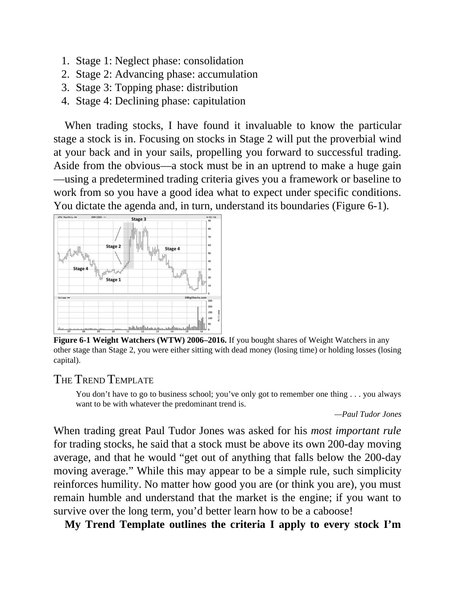 |
| 105 | 260 | 1 | 0 | 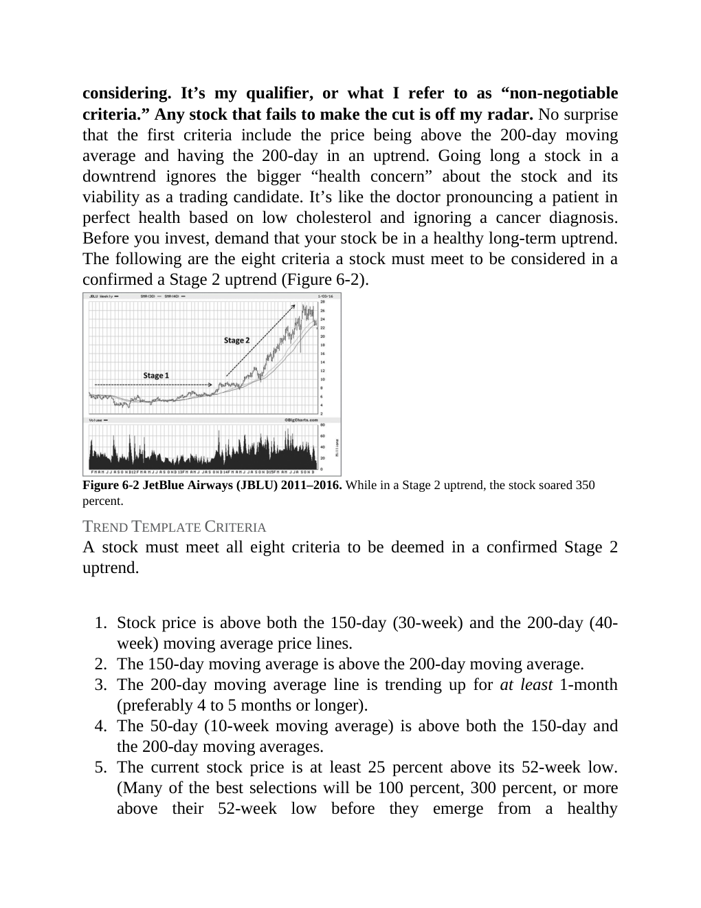 |
| 107 | 291 | 1 | 0 | 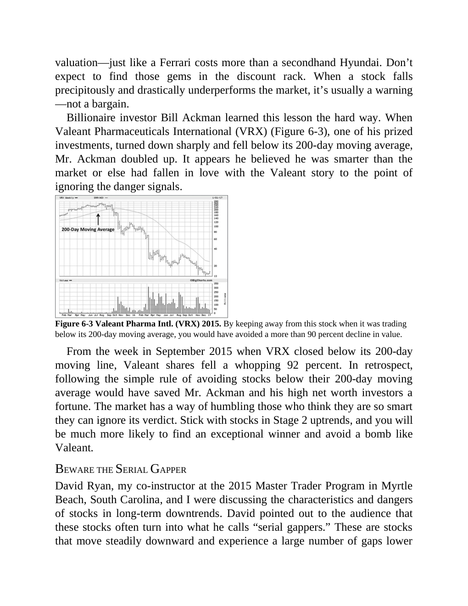 |
| 108 | 313 | 1 | 0 | 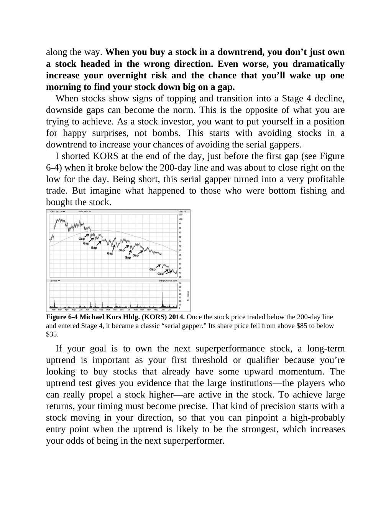 |
| 110 | 299 | 1 | 0 | 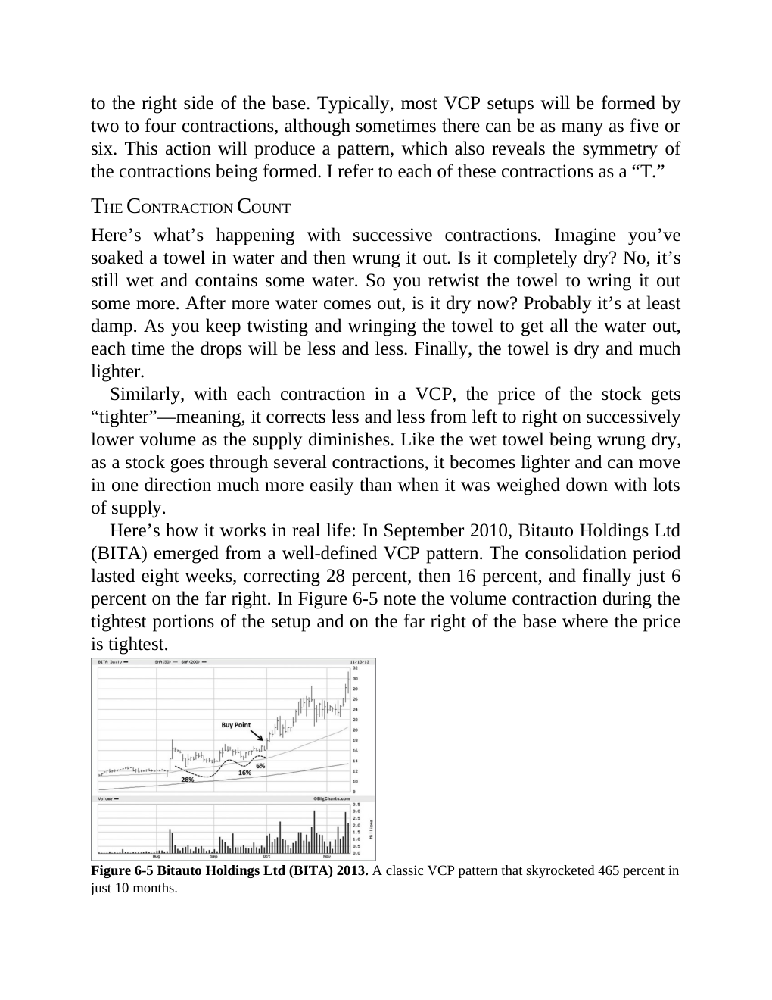 |
| 112 | 234 | 1 | 0 | 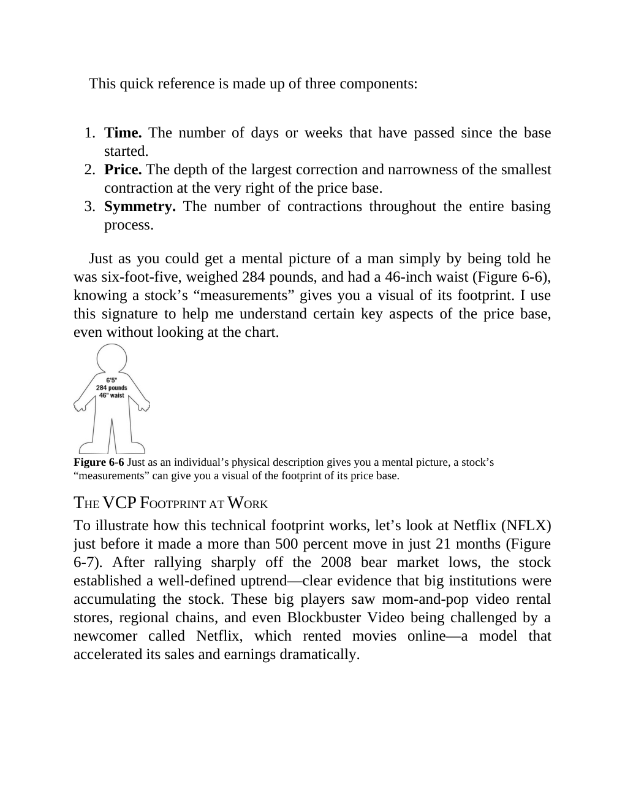 |
| 113 | 263 | 1 | 0 | 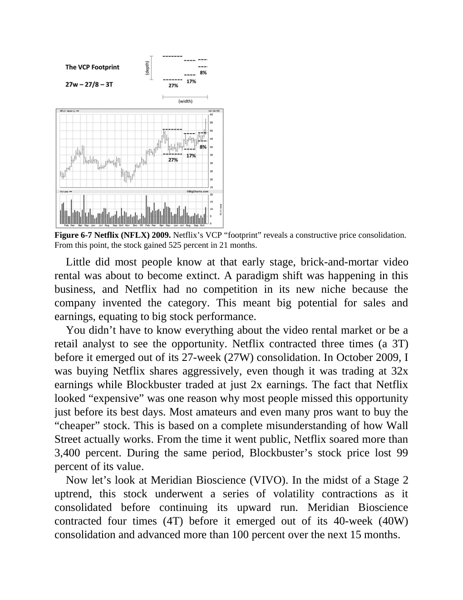 |
| 114 | 309 | 1 | 0 | 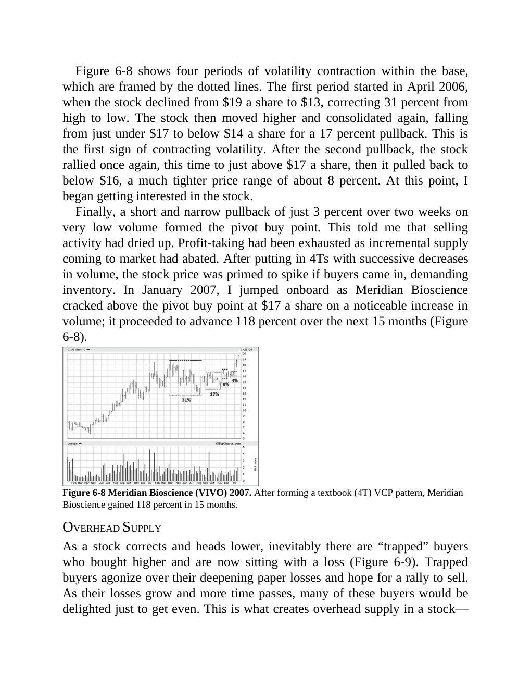 |
| 115 | 318 | 1 | 0 | 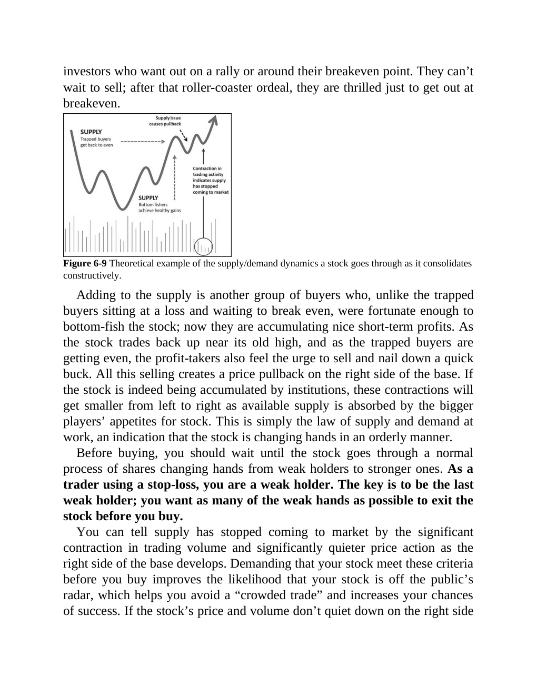 |
| 117 | 327 | 1 | 0 | 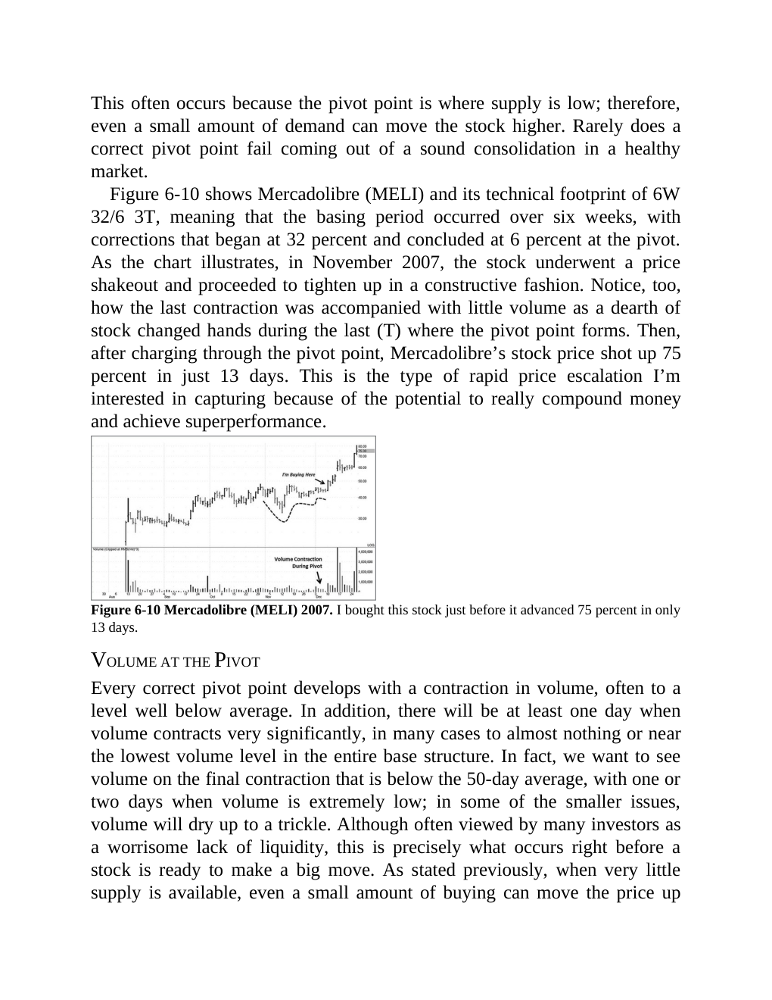 |
| 118 | 125 | 1 | 0 | 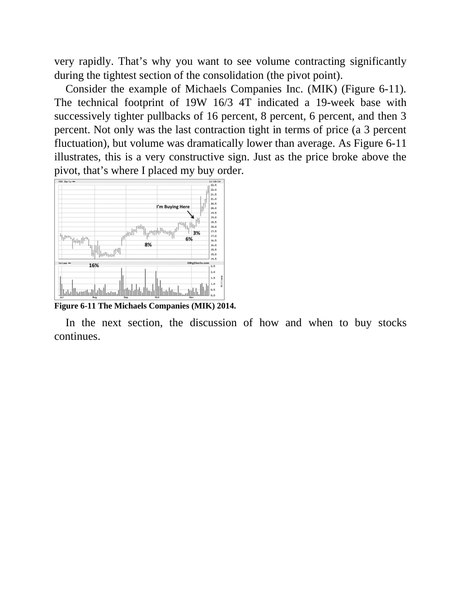 |

## Historical Pattern Lab

Go back to the pre-entry window in each market example. Judge whether the stock was forming the same kind of pattern discussed in this chapter before the scan entry.

| Market Example | Level | Return From Entry | Max Drawdown | Fundamental Score | Pattern Read |
|---|---:|---:|---:|---:|---|
| [[STAR]] | L1 | 8.2% | -4.61% | 4/6 | constructive; scan VCP 0/3; risk 17.89%; 120-session pre-entry depth split: 27.5% then 40.6%. ATR20% contracted into entry. Volume dried up near the final window. Entry was -1.4% from the 60-session pre-entry pivot. |
| [[RRKABEL]] | L1 | 10.06% | -9.74% | 6/6 | loose-or-extended; scan VCP 0/3; risk 19.98%; 120-session pre-entry depth split: 19.9% then 28.6%. ATR20% did not clearly contract into entry. Volume did not dry up near the final window. Entry was 7.7% from the 60-session pre-entry pivot. |
| [[AXISCADES]] | L2 | 6.11% | -4.29% | 5/6 | loose-or-extended; scan VCP 1/3; risk 31.81%; 120-session pre-entry depth split: 48.3% then 90.2%. ATR20% did not clearly contract into entry. Volume did not dry up near the final window. Entry was -4.1% from the 60-session pre-entry pivot. |
| [[GOKULAGRO]] | L1 | 5.95% | -1.92% | 6/6 | loose-or-extended; scan VCP 2/3; risk 24.76%; 120-session pre-entry depth split: 44.5% then 62.9%. ATR20% did not clearly contract into entry. Volume did not dry up near the final window. Entry was -7.9% from the 60-session pre-entry pivot. |
| [[SCI]] | L2 | -2.26% | -6.16% | 5/6 | borderline; scan VCP 1/3; risk 35.33%; 120-session pre-entry depth split: 40.6% then 51.1%. ATR20% contracted into entry. Volume did not dry up near the final window. Entry was 3.1% from the 60-session pre-entry pivot. |

## Questions To Answer While Reviewing

- What was the stock doing before the entry date: basing, tightening, trending, or failing?
- Did relative strength improve before price broke out?
- Was volume drying up in the base or expanding on the wrong side?
- Did fundamentals support leadership, or was the chart alone carrying the thesis?
- Which concept note should be updated after reviewing this chapter image?

## Tie-Back

- Book: [[Think and Trade Like a Champion]]
- Market examples: [[Market Example Index]]
- Checklist: [[Master Minervini Checklist]]
