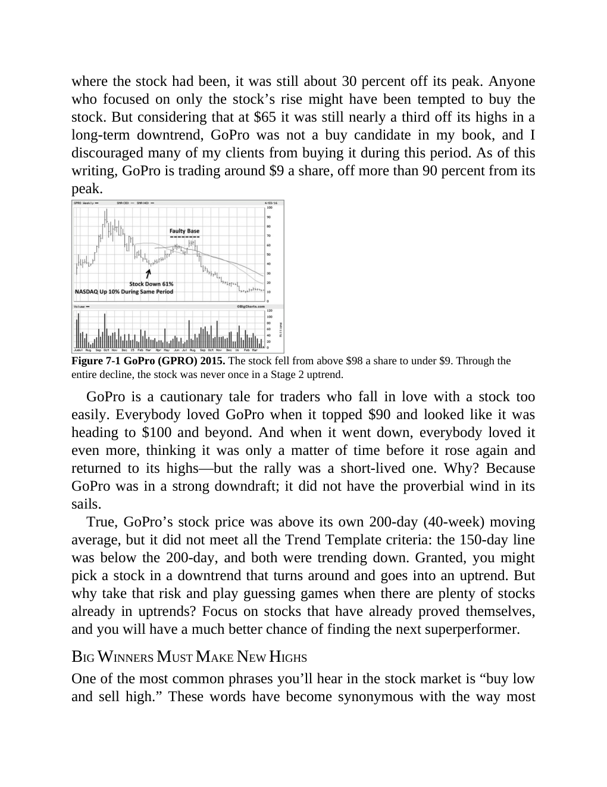
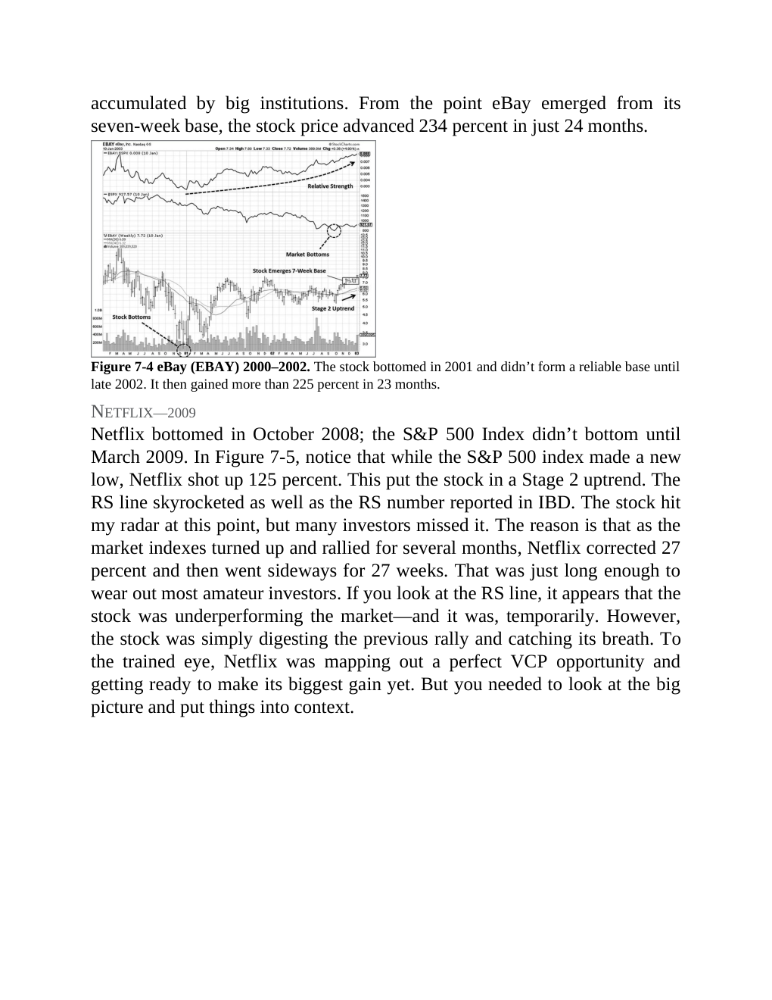
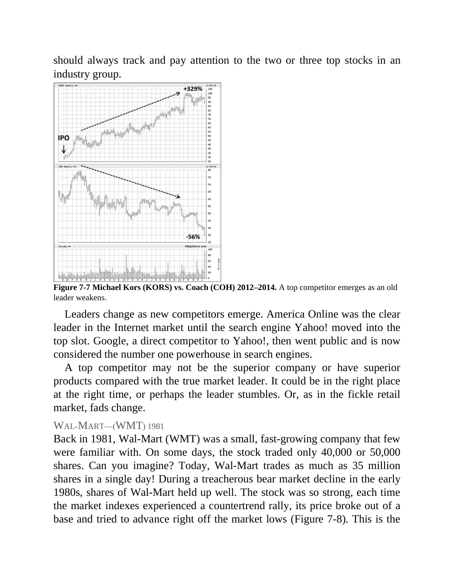

# Think and Trade Like a Champion - Section 7: How and When to Buy Stocks - Part 2

## Study Focus

Primary linked concepts: [[Relative Strength Leadership]], [[Pivot and Entry]], [[Stage 2 Uptrend]], [[Volatility Contraction Pattern]], [[Volume Dry-Up and Accumulation]]

## Concept Signals Found In This Chapter

| Concept | Text Signal Count | Candidate Pages |
|---|---:|---|
| [[Relative Strength Leadership]] | 136 | 119, 120, 121, 122, 123, 124, 125, 126 |
| [[Pivot and Entry]] | 27 | 122, 123, 124, 126, 129, 130, 131, 132 |
| [[Stage 2 Uptrend]] | 24 | 120, 121, 122, 123, 124, 125, 132, 133 |
| [[Volatility Contraction Pattern]] | 15 | 122, 125, 126, 127, 132, 134, 136, 137 |
| [[Volume Dry-Up and Accumulation]] | 14 | 131, 132, 134, 136, 137, 140 |
| [[Sell Rules and Failure Signals]] | 12 | 119, 120, 121, 124, 126, 133, 136, 137 |
| [[Trend Template]] | 11 | 120, 121, 122, 133, 138 |
| [[Risk First]] | 7 | 120, 124, 132, 135, 137 |

## Chapter Images

These are private visual anchors from the PDF. For each important chart or diagram, compare the pattern with at least one generated market example below.

| Page | Words | Images | Drawings | Private Page Image |
|---:|---:|---:|---:|---|
| 120 | 326 | 1 | 0 |  |
| 121 | 345 | 1 | 0 |  |
| 123 | 302 | 1 | 0 |  |
| 125 | 225 | 1 | 0 |  |
| 126 | 295 | 1 | 0 |  |
| 127 | 179 | 1 | 0 |  |
| 128 | 220 | 1 | 0 |  |
| 129 | 192 | 1 | 0 |  |
| 130 | 312 | 1 | 0 |  |
| 133 | 280 | 1 | 0 |  |
| 134 | 288 | 1 | 0 |  |
| 135 | 244 | 2 | 0 |  |
| 136 | 211 | 2 | 0 |  |
| 137 | 293 | 1 | 0 |  |
| 138 | 247 | 1 | 0 |  |
| 139 | 171 | 2 | 0 |  |
| 141 | 158 | 1 | 0 |  |

## Historical Pattern Lab

Go back to the pre-entry window in each market example. Judge whether the stock was forming the same kind of pattern discussed in this chapter before the scan entry.

| Market Example | Level | Return From Entry | Max Drawdown | Fundamental Score | Pattern Read |
|---|---:|---:|---:|---:|---|
| [[STAR]] | L1 | 8.2% | -4.61% | 4/6 | constructive; scan VCP 0/3; risk 17.89%; 120-session pre-entry depth split: 27.5% then 40.6%. ATR20% contracted into entry. Volume dried up near the final window. Entry was -1.4% from the 60-session pre-entry pivot. |
| [[RRKABEL]] | L1 | 10.06% | -9.74% | 6/6 | loose-or-extended; scan VCP 0/3; risk 19.98%; 120-session pre-entry depth split: 19.9% then 28.6%. ATR20% did not clearly contract into entry. Volume did not dry up near the final window. Entry was 7.7% from the 60-session pre-entry pivot. |
| [[AXISCADES]] | L2 | 6.11% | -4.29% | 5/6 | loose-or-extended; scan VCP 1/3; risk 31.81%; 120-session pre-entry depth split: 48.3% then 90.2%. ATR20% did not clearly contract into entry. Volume did not dry up near the final window. Entry was -4.1% from the 60-session pre-entry pivot. |
| [[GOKULAGRO]] | L1 | 5.95% | -1.92% | 6/6 | loose-or-extended; scan VCP 2/3; risk 24.76%; 120-session pre-entry depth split: 44.5% then 62.9%. ATR20% did not clearly contract into entry. Volume did not dry up near the final window. Entry was -7.9% from the 60-session pre-entry pivot. |
| [[SCI]] | L2 | -2.26% | -6.16% | 5/6 | borderline; scan VCP 1/3; risk 35.33%; 120-session pre-entry depth split: 40.6% then 51.1%. ATR20% contracted into entry. Volume did not dry up near the final window. Entry was 3.1% from the 60-session pre-entry pivot. |

## Questions To Answer While Reviewing

- What was the stock doing before the entry date: basing, tightening, trending, or failing?
- Did relative strength improve before price broke out?
- Was volume drying up in the base or expanding on the wrong side?
- Did fundamentals support leadership, or was the chart alone carrying the thesis?
- Which concept note should be updated after reviewing this chapter image?

## Tie-Back

- Book: [[Think and Trade Like a Champion]]
- Market examples: [[Market Example Index]]
- Checklist: [[Master Minervini Checklist]]
