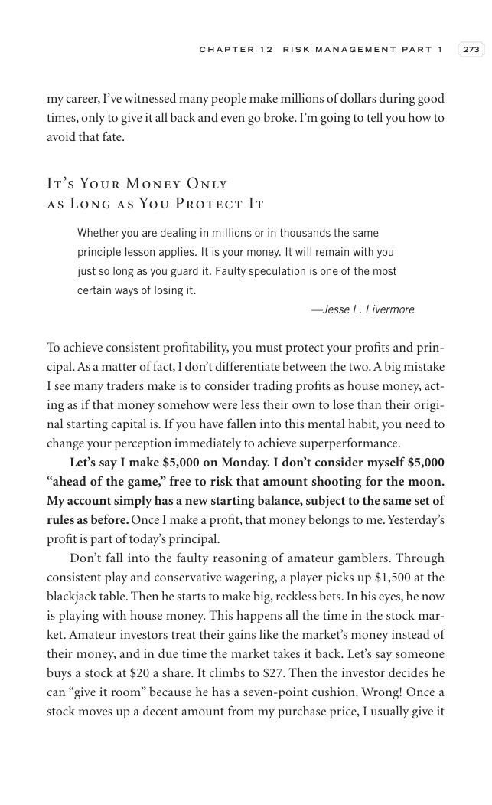
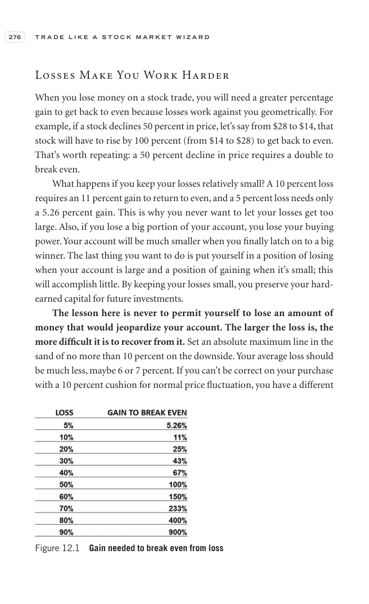
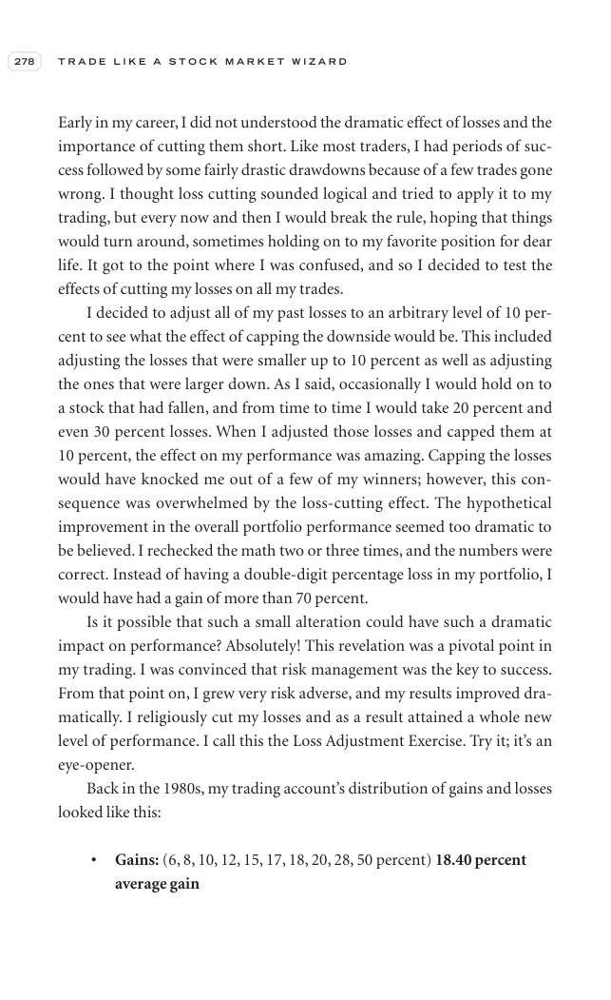
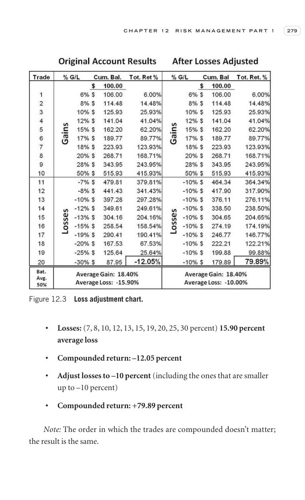
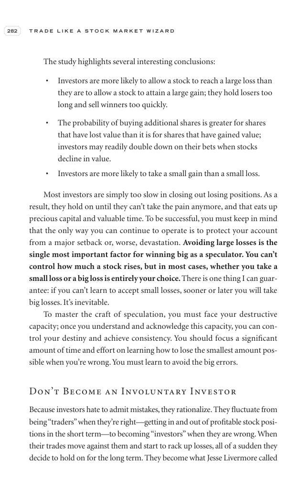
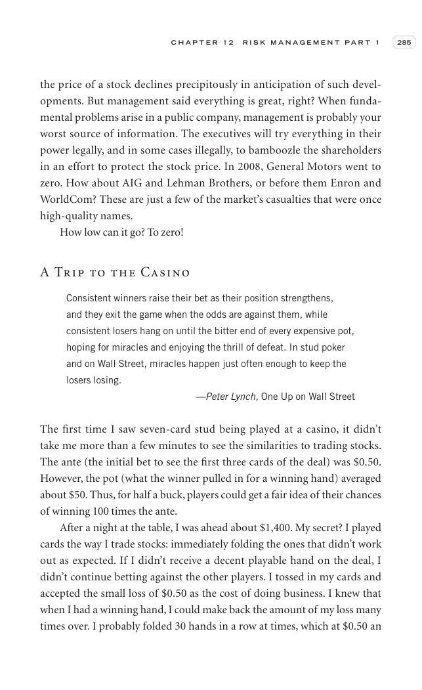
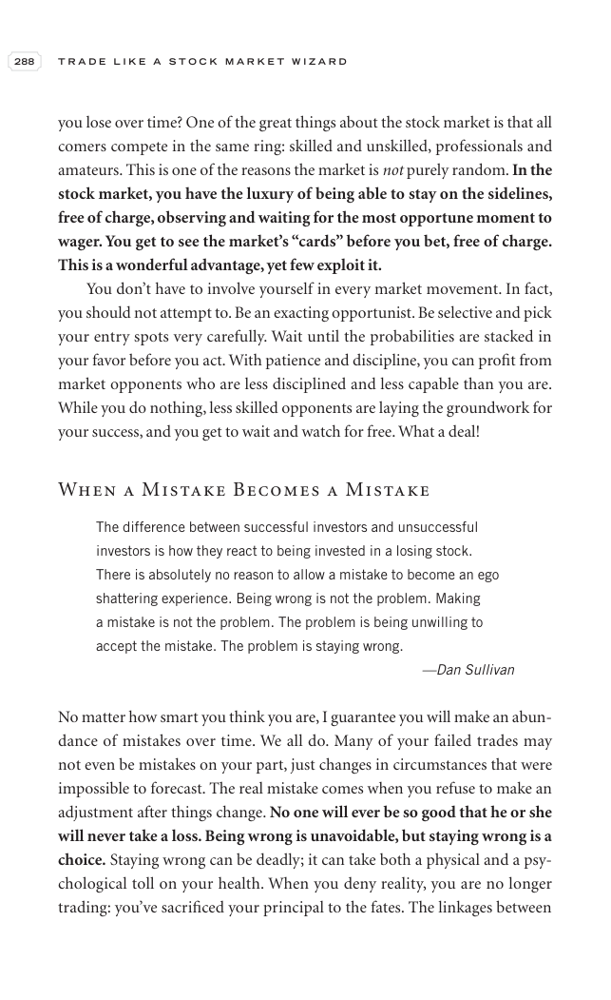
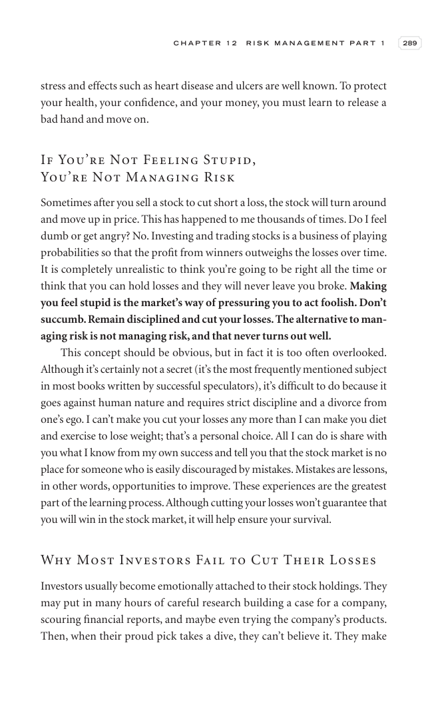

# Trade Like a Stock Market Wizard - Chapter 12 Risk Management Part 1: The Nature of Risk

## Study Focus

Primary linked concepts: [[Relative Strength Leadership]], [[Risk First]], [[Mental Discipline]], [[Sell Rules and Failure Signals]], [[Pivot and Entry]]

## Concept Signals Found In This Chapter

| Concept | Text Signal Count | Candidate Pages |
|---|---:|---|
| [[Relative Strength Leadership]] | 151 | 284, 285, 286, 287, 288, 289, 290, 291 |
| [[Risk First]] | 98 | 284, 285, 286, 287, 288, 289, 290, 291 |
| [[Mental Discipline]] | 19 | 287, 295, 296, 297, 298, 301, 303, 304 |
| [[Sell Rules and Failure Signals]] | 15 | 293, 295, 296, 297, 298, 300, 301, 302 |
| [[Pivot and Entry]] | 3 | 285, 293, 303 |
| [[Volume Dry-Up and Accumulation]] | 2 | 293, 298 |

## Chapter Images

These are private visual anchors from the PDF. For each important chart or diagram, compare the pattern with at least one generated market example below.

| Page | Words | Images | Drawings | Private Page Image |
|---:|---:|---:|---:|---|
| 284 | 272 | 0 | 18 |  |
| 285 | 465 | 0 | 18 |  |
| 286 | 468 | 0 | 18 |  |
| 287 | 397 | 0 | 18 |  |
| 288 | 373 | 0 | 18 |  |
| 289 | 366 | 0 | 18 |  |
| 290 | 400 | 0 | 18 |  |
| 291 | 322 | 1 | 18 |  |
| 292 | 230 | 1 | 18 |  |
| 293 | 415 | 0 | 18 |  |
| 294 | 89 | 1 | 18 |  |
| 295 | 357 | 0 | 18 |  |
| 296 | 367 | 0 | 18 |  |
| 297 | 376 | 0 | 18 |  |
| 298 | 408 | 0 | 18 |  |
| 299 | 434 | 0 | 18 |  |
| 300 | 385 | 0 | 18 |  |
| 301 | 432 | 0 | 18 |  |
| 302 | 431 | 0 | 18 |  |
| 303 | 399 | 0 | 18 |  |
| 304 | 398 | 0 | 18 |  |
| 305 | 449 | 0 | 18 |  |

## Historical Pattern Lab

Go back to the pre-entry window in each market example. Judge whether the stock was forming the same kind of pattern discussed in this chapter before the scan entry.

| Market Example | Level | Return From Entry | Max Drawdown | Fundamental Score | Pattern Read |
|---|---:|---:|---:|---:|---|
| [[NETWEB]] | L3 | -13.15% | -14.64% | 6/6 | borderline; scan VCP 0/3; risk 31.44%; 120-session pre-entry depth split: 28.5% then 47.6%. ATR20% contracted into entry. Volume did not dry up near the final window. Entry was -0.6% from the 60-session pre-entry pivot. |
| [[AVALON]] | L2 | -4.61% | -10.99% | 5/6 | loose-or-extended; scan VCP 0/3; risk 35.37%; 120-session pre-entry depth split: 37.7% then 52.5%. ATR20% did not clearly contract into entry. Volume did not dry up near the final window. Entry was 6.2% from the 60-session pre-entry pivot. |
| [[SYRMA]] | L2 | -7.9% | -10.28% | 6/6 | borderline; scan VCP 1/3; risk 29.79%; 120-session pre-entry depth split: 43.4% then 57.7%. ATR20% contracted into entry. Volume did not dry up near the final window. Entry was -0.4% from the 60-session pre-entry pivot. |
| [[RRKABEL]] | L1 | 10.06% | -9.74% | 6/6 | loose-or-extended; scan VCP 0/3; risk 19.98%; 120-session pre-entry depth split: 19.9% then 28.6%. ATR20% did not clearly contract into entry. Volume did not dry up near the final window. Entry was 7.7% from the 60-session pre-entry pivot. |
| [[EMCURE]] | L3 | -4.92% | -9.25% | 6/6 | loose-or-extended; scan VCP 1/3; risk 14.89%; 120-session pre-entry depth split: 21.4% then 28.1%. ATR20% did not clearly contract into entry. Volume did not dry up near the final window. Entry was 1.4% from the 60-session pre-entry pivot. |

## Questions To Answer While Reviewing

- What was the stock doing before the entry date: basing, tightening, trending, or failing?
- Did relative strength improve before price broke out?
- Was volume drying up in the base or expanding on the wrong side?
- Did fundamentals support leadership, or was the chart alone carrying the thesis?
- Which concept note should be updated after reviewing this chapter image?

## Tie-Back

- Book: [[Trade Like a Stock Market Wizard]]
- Market examples: [[Market Example Index]]
- Checklist: [[Master Minervini Checklist]]
