# Trade Like a Stock Market Wizard - Chapter 13 Risk Management Part 2: How to Deal With and Control Risk

## Study Focus

Primary linked concepts: [[Risk First]], [[Relative Strength Leadership]], [[Sell Rules and Failure Signals]], [[Mental Discipline]], [[Pivot and Entry]]

## Concept Signals Found In This Chapter

| Concept | Text Signal Count | Candidate Pages |
|---|---:|---|
| [[Risk First]] | 217 | 306, 307, 308, 309, 310, 311, 312, 313 |
| [[Relative Strength Leadership]] | 133 | 306, 307, 308, 309, 310, 311, 312, 313 |
| [[Sell Rules and Failure Signals]] | 42 | 307, 308, 309, 310, 311, 314, 315, 316 |
| [[Mental Discipline]] | 15 | 307, 308, 310, 317, 321, 330 |
| [[Pivot and Entry]] | 3 | 310, 320 |
| [[Volume Dry-Up and Accumulation]] | 1 | 310 |

## Chapter Images

These are private visual anchors from the PDF. For each important chart or diagram, compare the pattern with at least one generated market example below.

| Page | Words | Images | Drawings | Private Page Image |
|---:|---:|---:|---:|---|
| 306 | 228 | 0 | 18 | 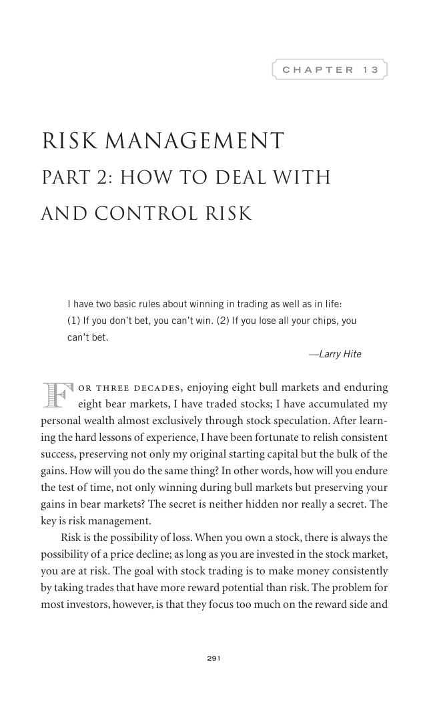 |
| 307 | 415 | 0 | 18 | 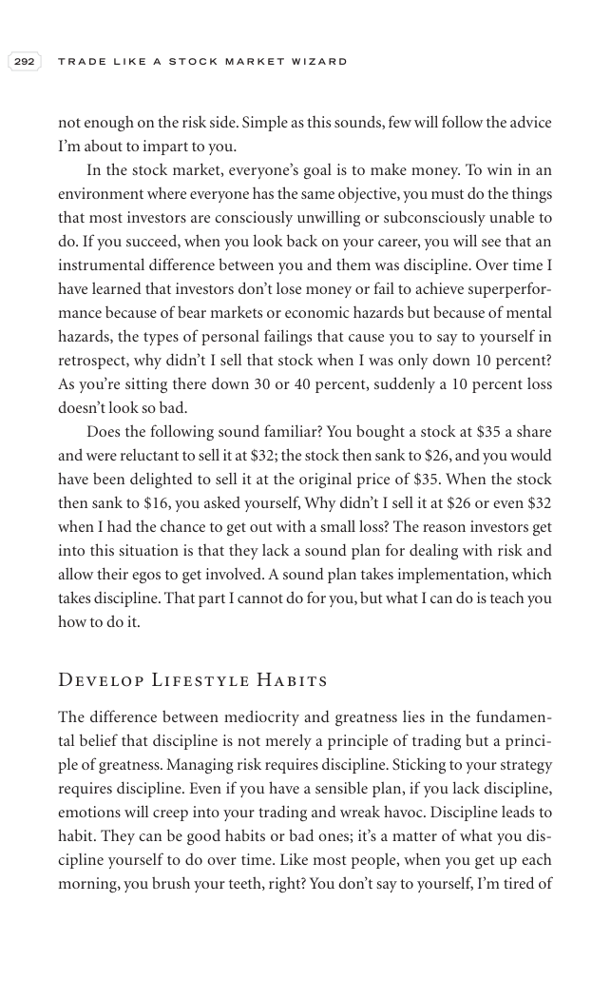 |
| 308 | 388 | 0 | 18 | 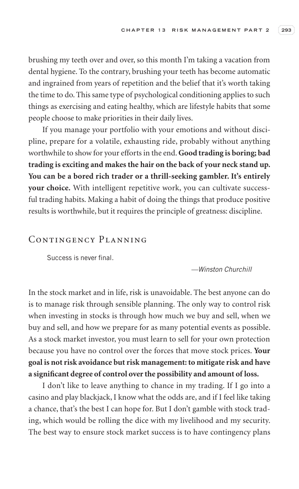 |
| 309 | 408 | 0 | 18 |  |
| 310 | 439 | 0 | 18 |  |
| 311 | 368 | 0 | 18 | 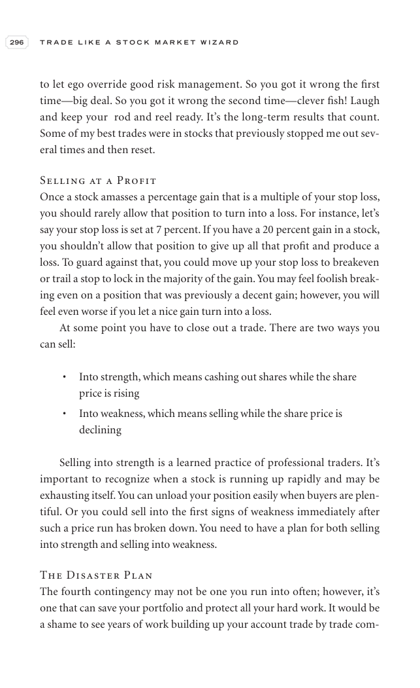 |
| 312 | 377 | 0 | 18 |  |
| 313 | 441 | 0 | 18 | 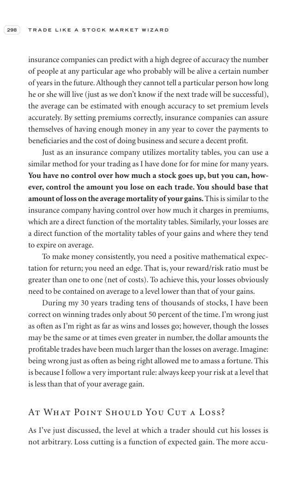 |
| 314 | 440 | 0 | 18 | 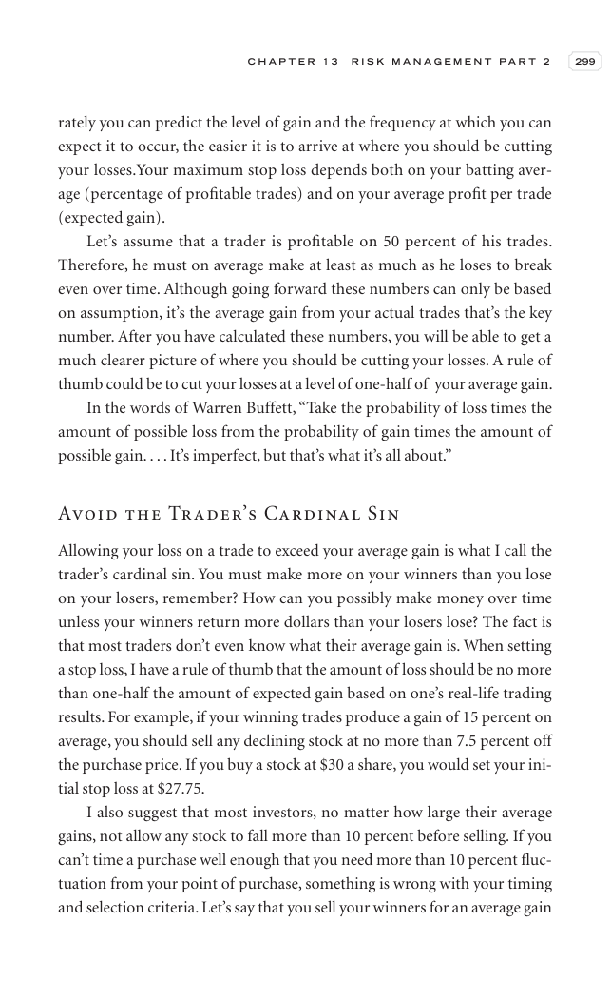 |
| 315 | 425 | 0 | 18 |  |
| 316 | 424 | 0 | 18 |  |
| 317 | 433 | 0 | 18 | 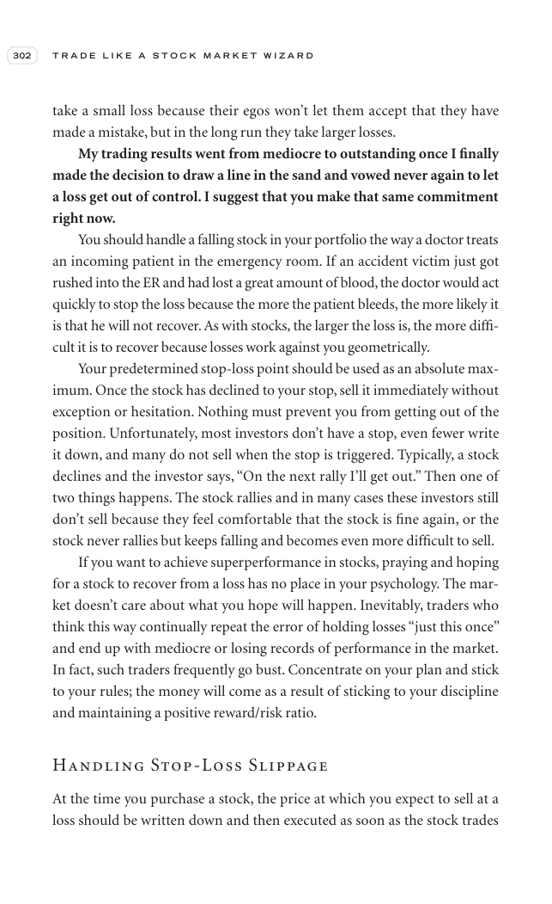 |
| 318 | 390 | 0 | 18 | 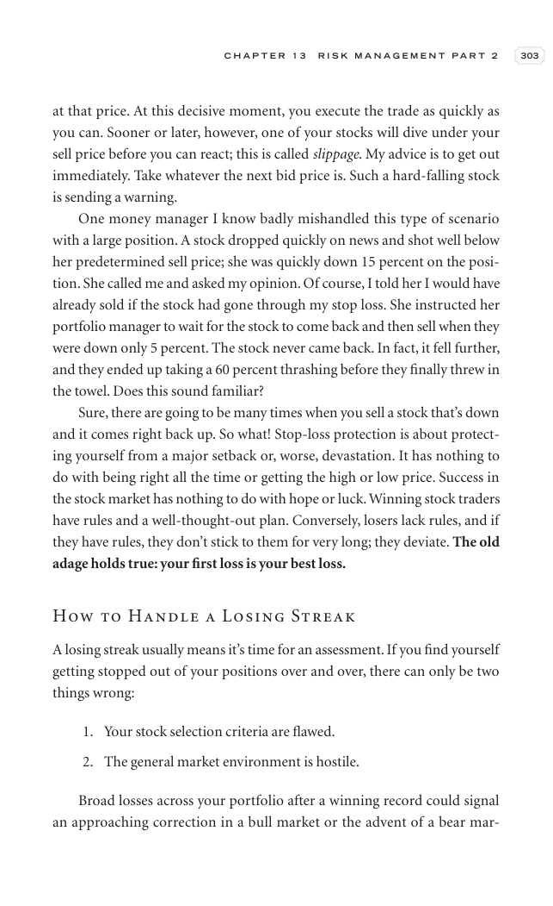 |
| 319 | 402 | 0 | 18 | 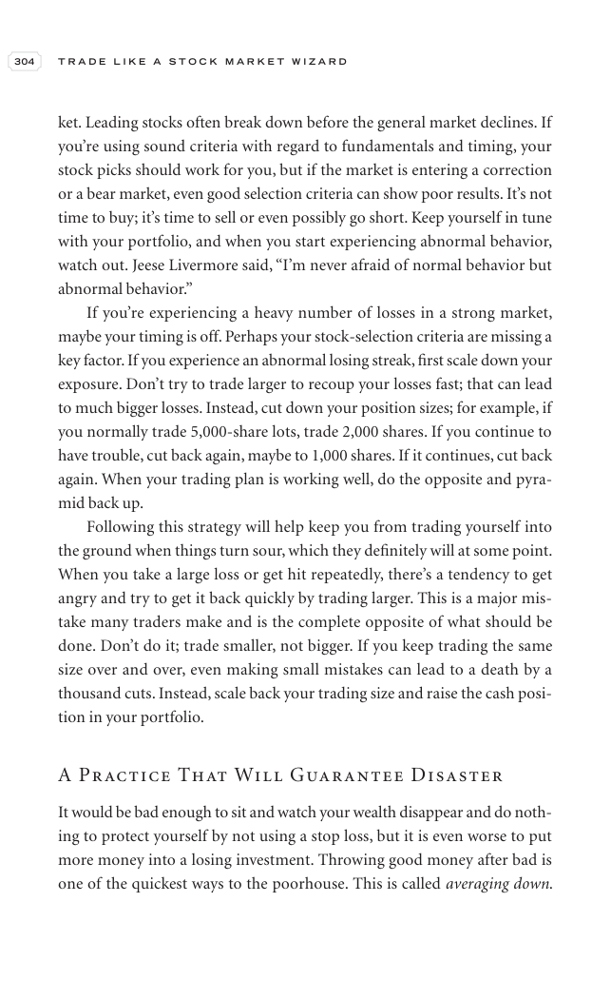 |
| 320 | 429 | 0 | 18 | 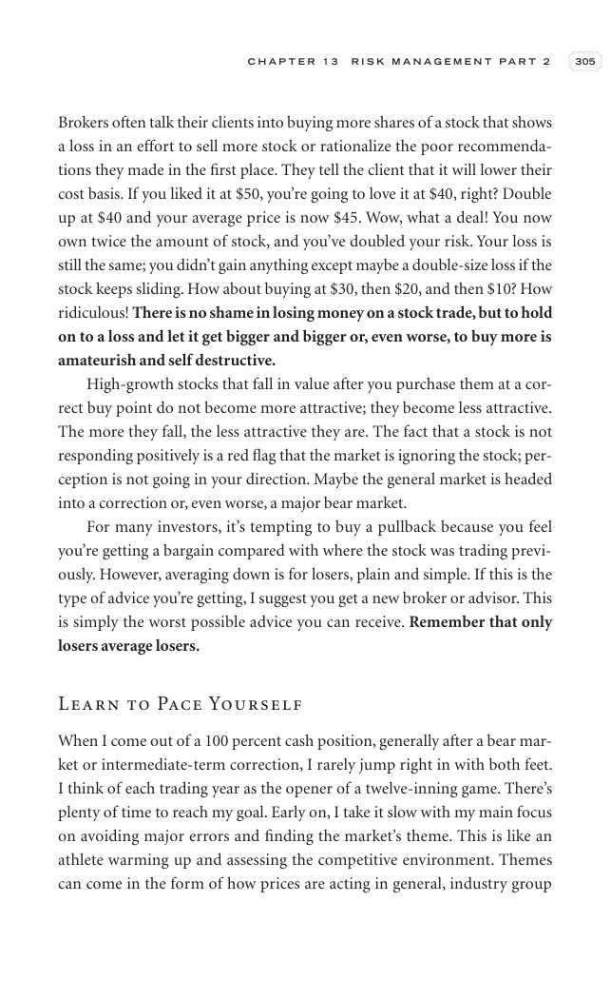 |
| 321 | 396 | 0 | 18 |  |
| 322 | 428 | 0 | 18 |  |
| 323 | 432 | 0 | 18 | 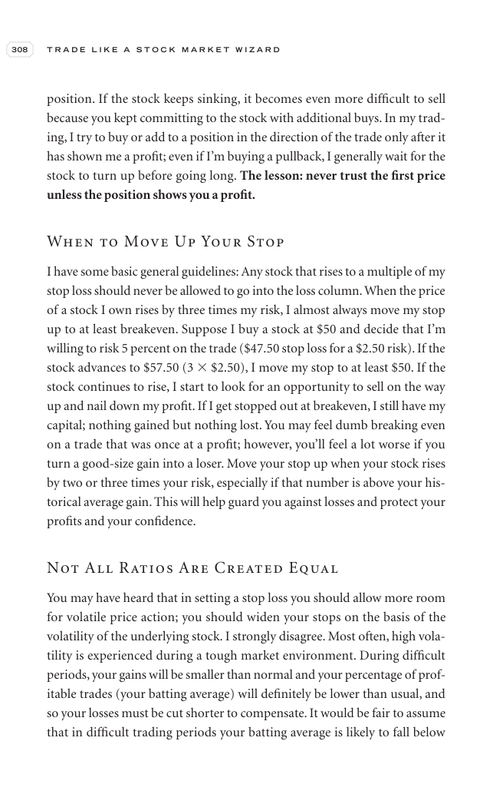 |
| 324 | 222 | 1 | 18 | 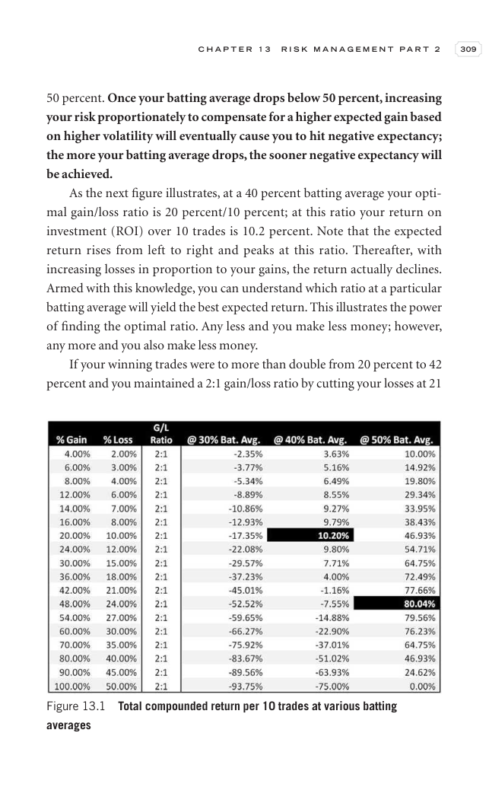 |
| 325 | 273 | 1 | 18 | 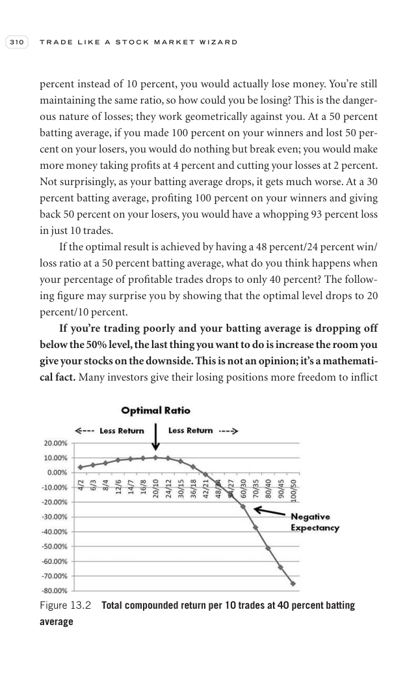 |
| 326 | 298 | 0 | 18 | 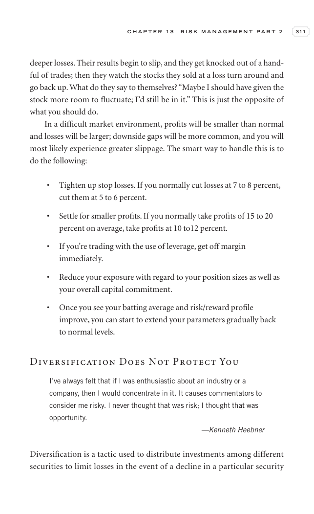 |
| 327 | 382 | 0 | 18 | 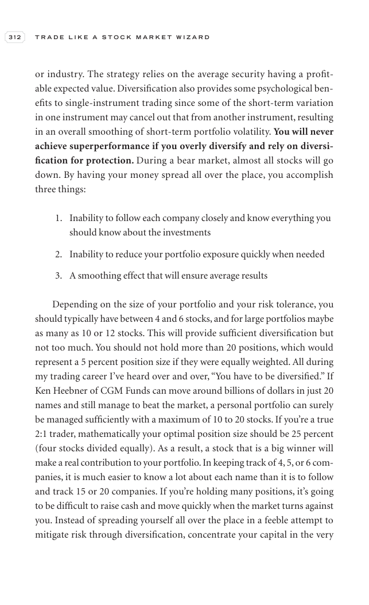 |
| 328 | 386 | 0 | 18 | 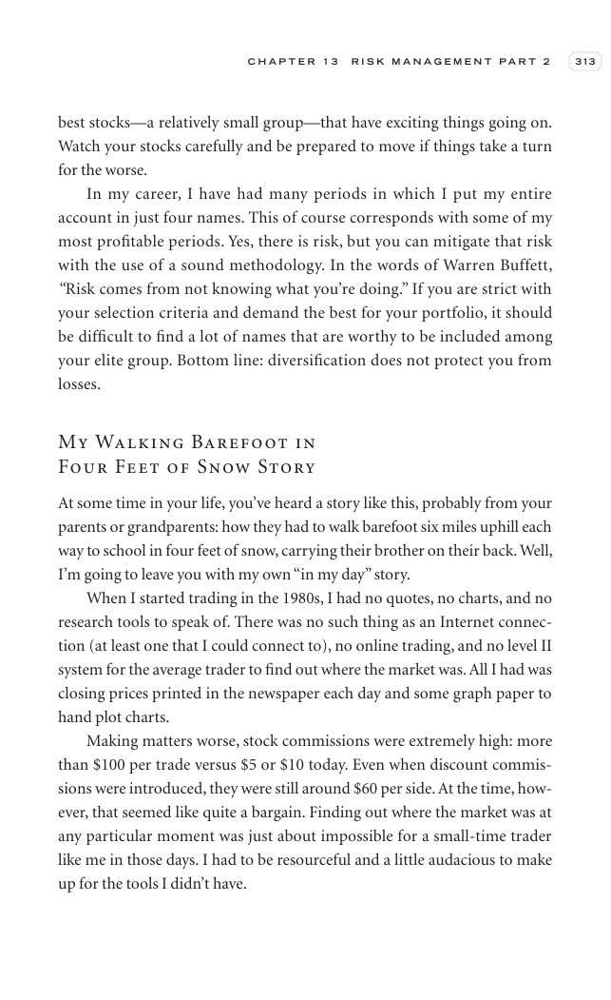 |
| 329 | 425 | 0 | 18 | 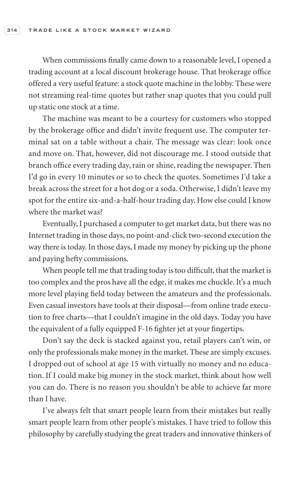 |
| 330 | 86 | 0 | 18 |  |
| 331 | 5 | 0 | 0 |  |

## Historical Pattern Lab

Go back to the pre-entry window in each market example. Judge whether the stock was forming the same kind of pattern discussed in this chapter before the scan entry.

| Market Example | Level | Return From Entry | Max Drawdown | Fundamental Score | Pattern Read |
|---|---:|---:|---:|---:|---|
| [[NETWEB]] | L3 | -13.15% | -14.64% | 6/6 | borderline; scan VCP 0/3; risk 31.44%; 120-session pre-entry depth split: 28.5% then 47.6%. ATR20% contracted into entry. Volume did not dry up near the final window. Entry was -0.6% from the 60-session pre-entry pivot. |
| [[AVALON]] | L2 | -4.61% | -10.99% | 5/6 | loose-or-extended; scan VCP 0/3; risk 35.37%; 120-session pre-entry depth split: 37.7% then 52.5%. ATR20% did not clearly contract into entry. Volume did not dry up near the final window. Entry was 6.2% from the 60-session pre-entry pivot. |
| [[SYRMA]] | L2 | -7.9% | -10.28% | 6/6 | borderline; scan VCP 1/3; risk 29.79%; 120-session pre-entry depth split: 43.4% then 57.7%. ATR20% contracted into entry. Volume did not dry up near the final window. Entry was -0.4% from the 60-session pre-entry pivot. |
| [[RRKABEL]] | L1 | 10.06% | -9.74% | 6/6 | loose-or-extended; scan VCP 0/3; risk 19.98%; 120-session pre-entry depth split: 19.9% then 28.6%. ATR20% did not clearly contract into entry. Volume did not dry up near the final window. Entry was 7.7% from the 60-session pre-entry pivot. |
| [[EMCURE]] | L3 | -4.92% | -9.25% | 6/6 | loose-or-extended; scan VCP 1/3; risk 14.89%; 120-session pre-entry depth split: 21.4% then 28.1%. ATR20% did not clearly contract into entry. Volume did not dry up near the final window. Entry was 1.4% from the 60-session pre-entry pivot. |

## Questions To Answer While Reviewing

- What was the stock doing before the entry date: basing, tightening, trending, or failing?
- Did relative strength improve before price broke out?
- Was volume drying up in the base or expanding on the wrong side?
- Did fundamentals support leadership, or was the chart alone carrying the thesis?
- Which concept note should be updated after reviewing this chapter image?

## Tie-Back

- Book: [[Trade Like a Stock Market Wizard]]
- Market examples: [[Market Example Index]]
- Checklist: [[Master Minervini Checklist]]
