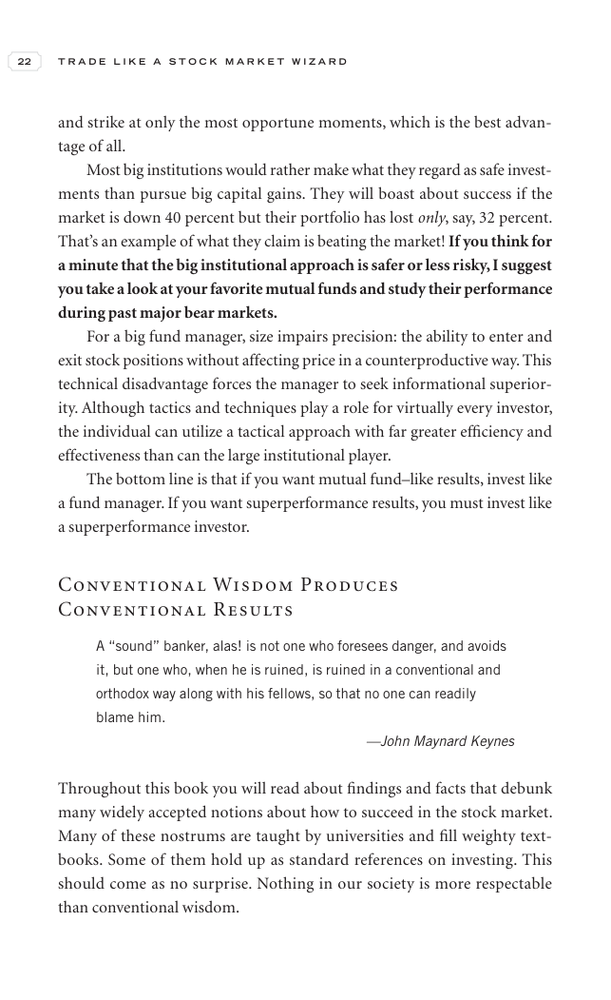
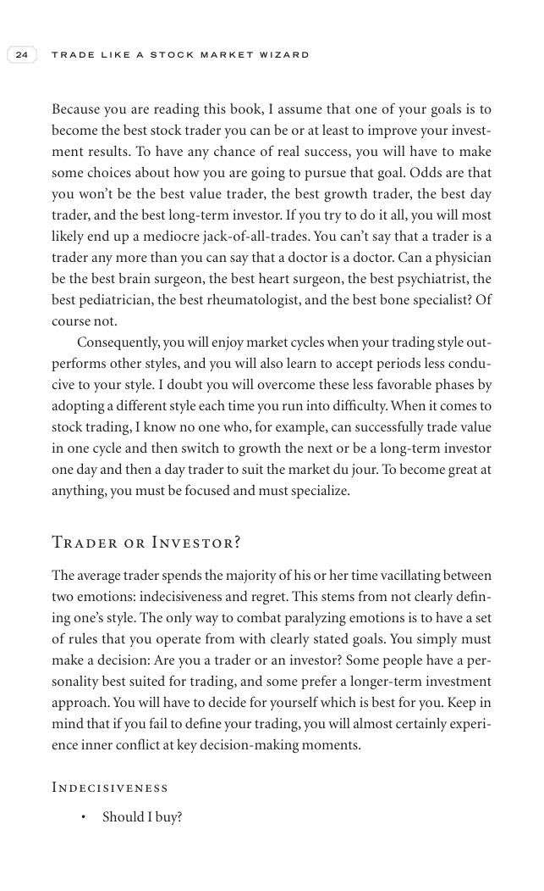
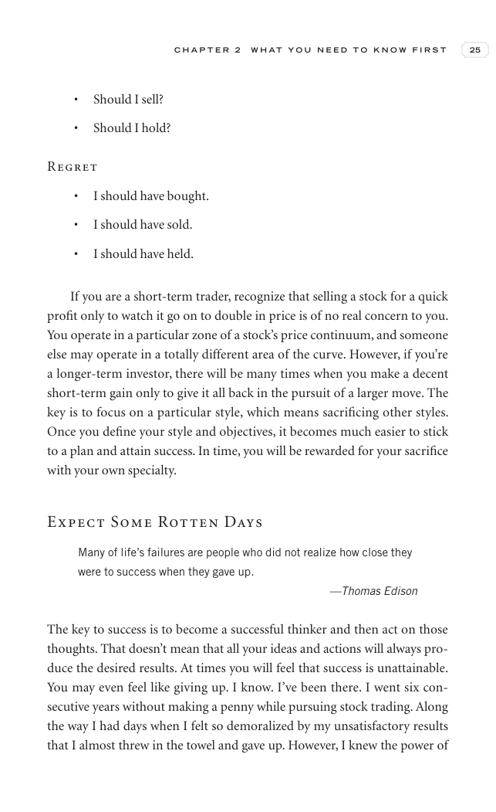

# Trade Like a Stock Market Wizard - Chapter 2 What You Need to Know First

## Study Focus

Primary linked concepts: [[Relative Strength Leadership]], [[Risk First]], [[Sell Rules and Failure Signals]], [[Mental Discipline]], [[Volume Dry-Up and Accumulation]]

## Concept Signals Found In This Chapter

| Concept | Text Signal Count | Candidate Pages |
|---|---:|---|
| [[Relative Strength Leadership]] | 99 | 26, 27, 28, 29, 30, 31, 32, 33 |
| [[Risk First]] | 26 | 26, 27, 28, 30, 31, 32, 33, 34 |
| [[Sell Rules and Failure Signals]] | 18 | 28, 31, 32, 34, 35, 36, 37, 40 |
| [[Mental Discipline]] | 9 | 26, 29, 30, 33, 39 |
| [[Volume Dry-Up and Accumulation]] | 3 | 34 |
| [[Pivot and Entry]] | 1 | 36 |
| [[Stage 2 Uptrend]] | 1 | 31 |

## Chapter Images

These are private visual anchors from the PDF. For each important chart or diagram, compare the pattern with at least one generated market example below.

| Page | Words | Images | Drawings | Private Page Image |
|---:|---:|---:|---:|---|
| 26 | 225 | 0 | 18 |  |
| 27 | 350 | 0 | 18 |  |
| 28 | 470 | 0 | 18 |  |
| 29 | 376 | 0 | 18 |  |
| 30 | 458 | 0 | 18 |  |
| 31 | 448 | 0 | 18 |  |
| 32 | 419 | 0 | 18 |  |
| 33 | 388 | 0 | 18 |  |
| 34 | 451 | 0 | 18 |  |
| 35 | 368 | 0 | 18 |  |
| 36 | 437 | 0 | 18 |  |
| 37 | 333 | 0 | 18 |  |
| 38 | 328 | 0 | 18 |  |
| 39 | 398 | 0 | 18 |  |
| 40 | 307 | 0 | 18 |  |
| 41 | 418 | 0 | 18 |  |

## Historical Pattern Lab

Go back to the pre-entry window in each market example. Judge whether the stock was forming the same kind of pattern discussed in this chapter before the scan entry.

| Market Example | Level | Return From Entry | Max Drawdown | Fundamental Score | Pattern Read |
|---|---:|---:|---:|---:|---|
| [[NETWEB]] | L3 | -13.15% | -14.64% | 6/6 | borderline; scan VCP 0/3; risk 31.44%; 120-session pre-entry depth split: 28.5% then 47.6%. ATR20% contracted into entry. Volume did not dry up near the final window. Entry was -0.6% from the 60-session pre-entry pivot. |
| [[AVALON]] | L2 | -4.61% | -10.99% | 5/6 | loose-or-extended; scan VCP 0/3; risk 35.37%; 120-session pre-entry depth split: 37.7% then 52.5%. ATR20% did not clearly contract into entry. Volume did not dry up near the final window. Entry was 6.2% from the 60-session pre-entry pivot. |
| [[SYRMA]] | L2 | -7.9% | -10.28% | 6/6 | borderline; scan VCP 1/3; risk 29.79%; 120-session pre-entry depth split: 43.4% then 57.7%. ATR20% contracted into entry. Volume did not dry up near the final window. Entry was -0.4% from the 60-session pre-entry pivot. |
| [[RRKABEL]] | L1 | 10.06% | -9.74% | 6/6 | loose-or-extended; scan VCP 0/3; risk 19.98%; 120-session pre-entry depth split: 19.9% then 28.6%. ATR20% did not clearly contract into entry. Volume did not dry up near the final window. Entry was 7.7% from the 60-session pre-entry pivot. |
| [[EMCURE]] | L3 | -4.92% | -9.25% | 6/6 | loose-or-extended; scan VCP 1/3; risk 14.89%; 120-session pre-entry depth split: 21.4% then 28.1%. ATR20% did not clearly contract into entry. Volume did not dry up near the final window. Entry was 1.4% from the 60-session pre-entry pivot. |

## Questions To Answer While Reviewing

- What was the stock doing before the entry date: basing, tightening, trending, or failing?
- Did relative strength improve before price broke out?
- Was volume drying up in the base or expanding on the wrong side?
- Did fundamentals support leadership, or was the chart alone carrying the thesis?
- Which concept note should be updated after reviewing this chapter image?

## Tie-Back

- Book: [[Trade Like a Stock Market Wizard]]
- Market examples: [[Market Example Index]]
- Checklist: [[Master Minervini Checklist]]
