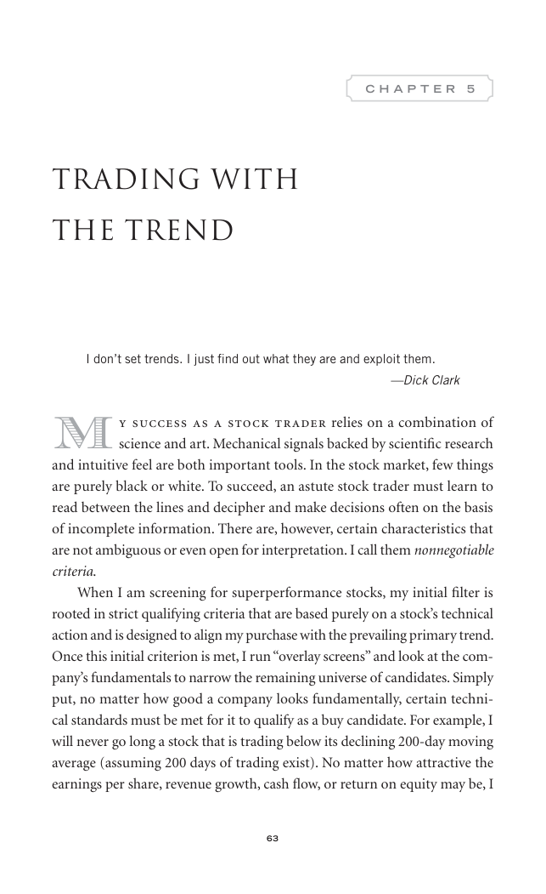
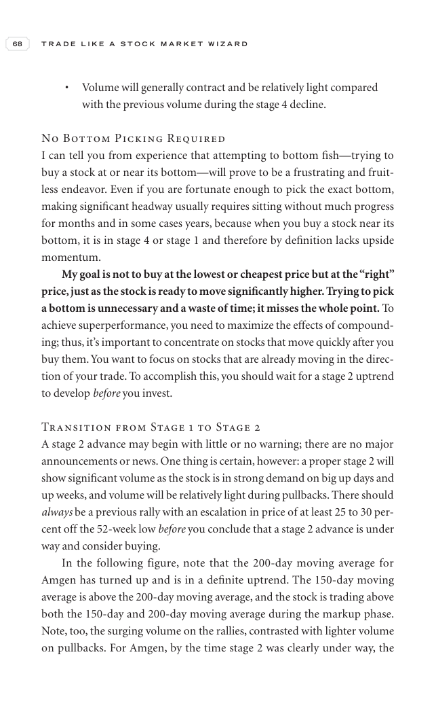
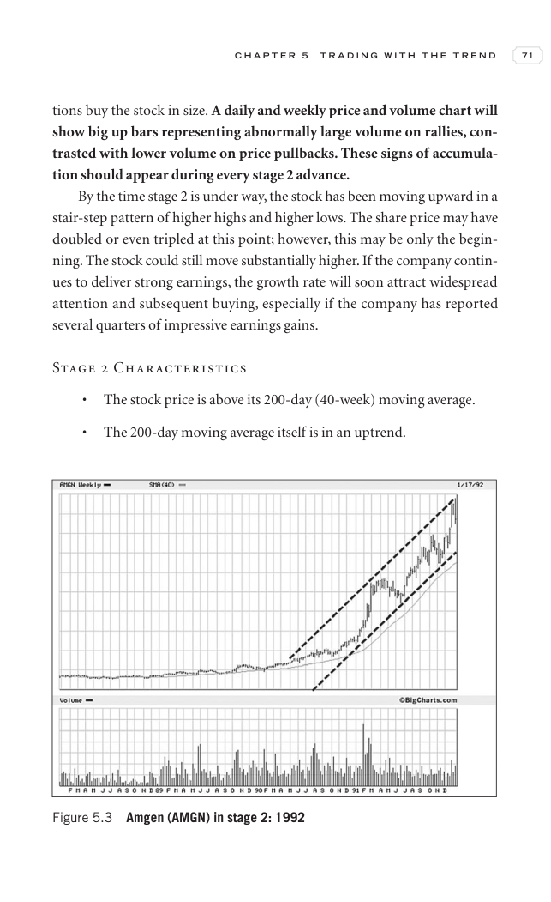
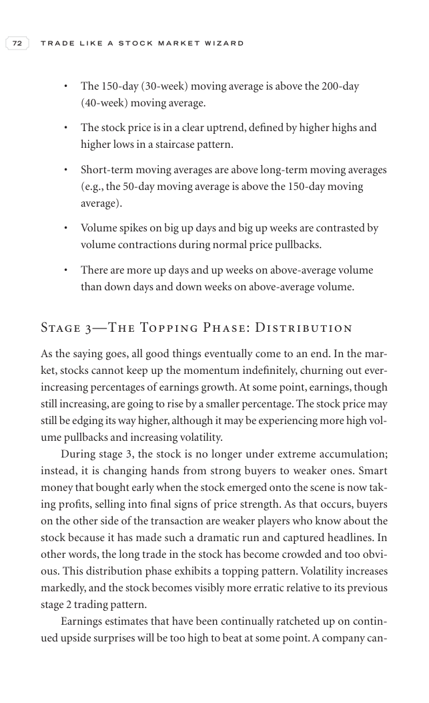
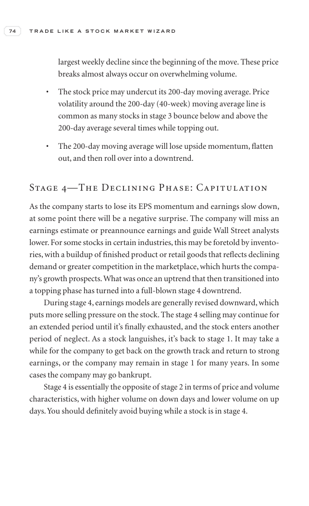
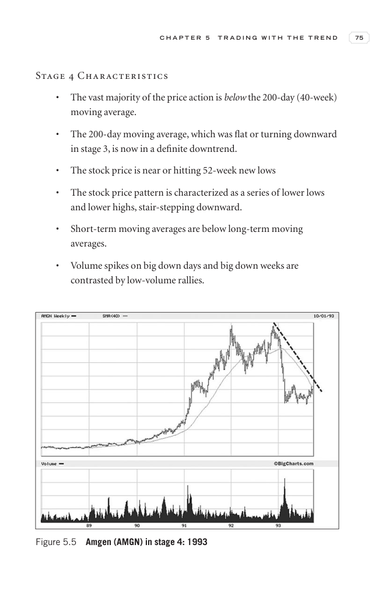
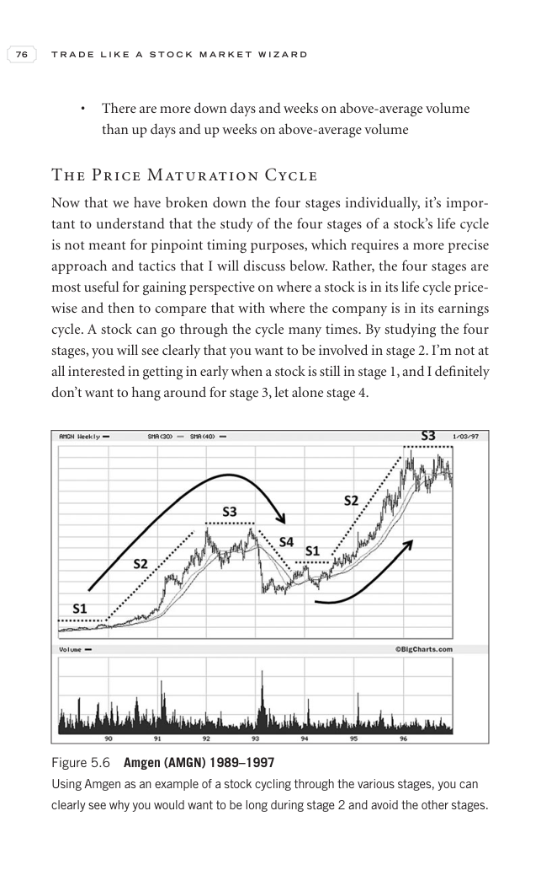
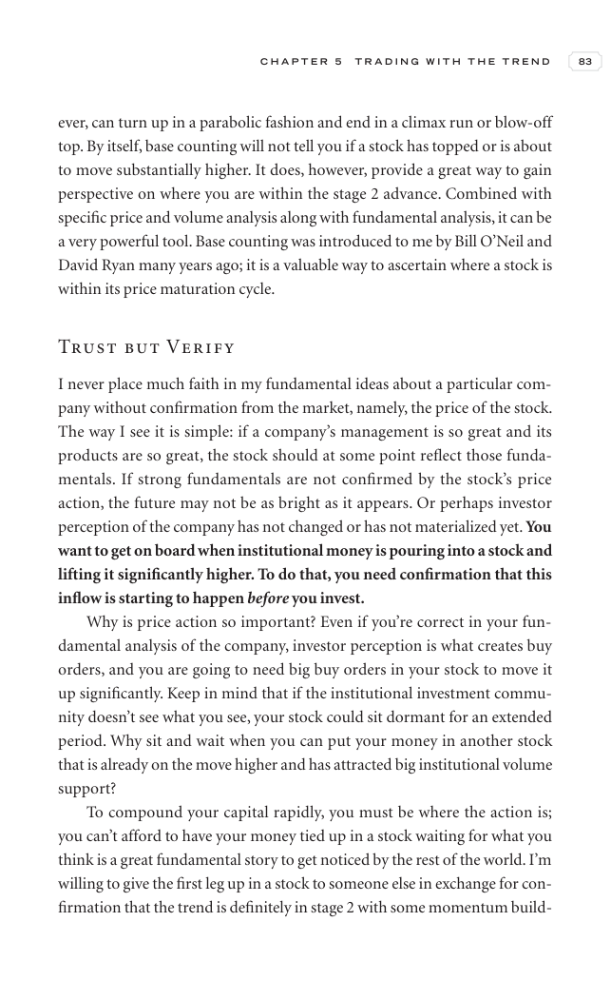

# Trade Like a Stock Market Wizard - Chapter 5 Trading With the Trend

## Study Focus

Primary linked concepts: [[Relative Strength Leadership]], [[Stage 2 Uptrend]], [[Volume Dry-Up and Accumulation]], [[Trend Template]], [[Sell Rules and Failure Signals]]

## Concept Signals Found In This Chapter

| Concept | Text Signal Count | Candidate Pages |
|---|---:|---|
| [[Relative Strength Leadership]] | 77 | 78, 79, 80, 81, 82, 83, 84, 85 |
| [[Stage 2 Uptrend]] | 76 | 79, 80, 81, 82, 83, 84, 85, 86 |
| [[Volume Dry-Up and Accumulation]] | 45 | 80, 81, 83, 85, 86, 87, 88, 89 |
| [[Trend Template]] | 39 | 78, 82, 83, 84, 86, 87, 89, 90 |
| [[Sell Rules and Failure Signals]] | 22 | 79, 80, 81, 87, 89, 96, 97, 98 |
| [[Risk First]] | 6 | 84, 94, 99, 100, 101, 102 |
| [[Volatility Contraction Pattern]] | 1 | 87 |

## Chapter Images

These are private visual anchors from the PDF. For each important chart or diagram, compare the pattern with at least one generated market example below.

| Page | Words | Images | Drawings | Private Page Image |
|---:|---:|---:|---:|---|
| 78 | 241 | 0 | 18 |  |
| 79 | 440 | 0 | 18 |  |
| 80 | 390 | 0 | 18 |  |
| 81 | 366 | 0 | 18 |  |
| 82 | 172 | 1 | 19 |  |
| 83 | 405 | 0 | 18 |  |
| 84 | 169 | 1 | 19 |  |
| 85 | 182 | 1 | 19 |  |
| 86 | 186 | 1 | 19 |  |
| 87 | 333 | 0 | 18 |  |
| 88 | 168 | 1 | 19 |  |
| 89 | 330 | 0 | 18 |  |
| 90 | 122 | 1 | 19 |  |
| 91 | 229 | 1 | 19 |  |
| 92 | 53 | 2 | 18 |  |
| 93 | 55 | 2 | 18 |  |
| 94 | 386 | 0 | 47 |  |
| 95 | 404 | 0 | 18 |  |
| 96 | 245 | 1 | 19 |  |
| 97 | 50 | 2 | 18 |  |
| 98 | 429 | 0 | 18 |  |
| 99 | 190 | 1 | 19 |  |
| 100 | 227 | 1 | 19 |  |
| 101 | 201 | 1 | 19 |  |
| 102 | 211 | 1 | 19 |  |
| 103 | 59 | 2 | 17 |  |
| 104 | 169 | 1 | 19 |  |
| 105 | 213 | 1 | 19 |  |
| 106 | 224 | 1 | 19 |  |
| 107 | 39 | 2 | 18 |  |
| 108 | 256 | 1 | 19 |  |
| 109 | 207 | 1 | 19 |  |

## Historical Pattern Lab

Go back to the pre-entry window in each market example. Judge whether the stock was forming the same kind of pattern discussed in this chapter before the scan entry.

| Market Example | Level | Return From Entry | Max Drawdown | Fundamental Score | Pattern Read |
|---|---:|---:|---:|---:|---|
| [[NETWEB]] | L3 | -13.15% | -14.64% | 6/6 | borderline; scan VCP 0/3; risk 31.44%; 120-session pre-entry depth split: 28.5% then 47.6%. ATR20% contracted into entry. Volume did not dry up near the final window. Entry was -0.6% from the 60-session pre-entry pivot. |
| [[AVALON]] | L2 | -4.61% | -10.99% | 5/6 | loose-or-extended; scan VCP 0/3; risk 35.37%; 120-session pre-entry depth split: 37.7% then 52.5%. ATR20% did not clearly contract into entry. Volume did not dry up near the final window. Entry was 6.2% from the 60-session pre-entry pivot. |
| [[SYRMA]] | L2 | -7.9% | -10.28% | 6/6 | borderline; scan VCP 1/3; risk 29.79%; 120-session pre-entry depth split: 43.4% then 57.7%. ATR20% contracted into entry. Volume did not dry up near the final window. Entry was -0.4% from the 60-session pre-entry pivot. |
| [[RRKABEL]] | L1 | 10.06% | -9.74% | 6/6 | loose-or-extended; scan VCP 0/3; risk 19.98%; 120-session pre-entry depth split: 19.9% then 28.6%. ATR20% did not clearly contract into entry. Volume did not dry up near the final window. Entry was 7.7% from the 60-session pre-entry pivot. |
| [[EMCURE]] | L3 | -4.92% | -9.25% | 6/6 | loose-or-extended; scan VCP 1/3; risk 14.89%; 120-session pre-entry depth split: 21.4% then 28.1%. ATR20% did not clearly contract into entry. Volume did not dry up near the final window. Entry was 1.4% from the 60-session pre-entry pivot. |

## Questions To Answer While Reviewing

- What was the stock doing before the entry date: basing, tightening, trending, or failing?
- Did relative strength improve before price broke out?
- Was volume drying up in the base or expanding on the wrong side?
- Did fundamentals support leadership, or was the chart alone carrying the thesis?
- Which concept note should be updated after reviewing this chapter image?

## Tie-Back

- Book: [[Trade Like a Stock Market Wizard]]
- Market examples: [[Market Example Index]]
- Checklist: [[Master Minervini Checklist]]
