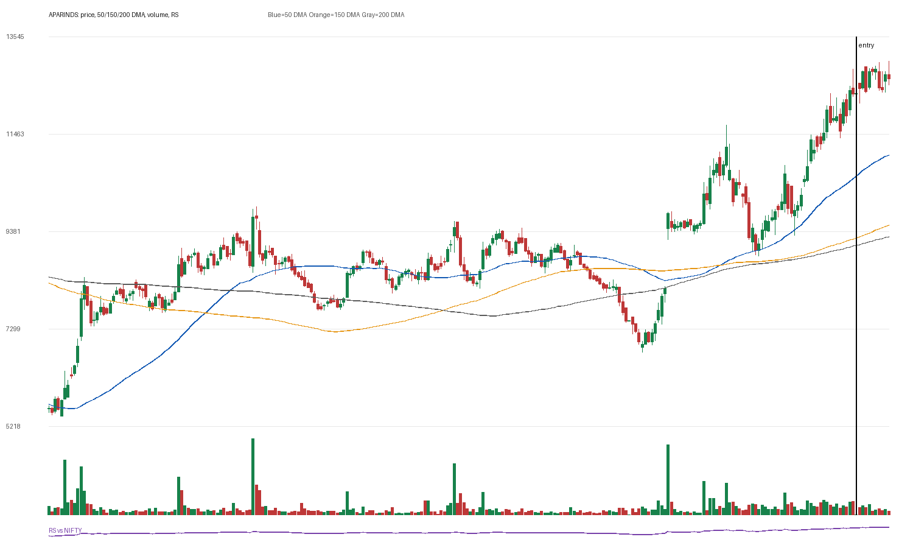

# APARINDS

## Entry Progress

| Metric | Value |
|---|---:|
| Yahoo symbol | `APARINDS.NS` |
| Entry close | 12331.0 |
| Latest close | 12650.0 |
| Current return from entry | 2.59% |
| Max gain after entry | 5.62% |
| Max drawdown after entry | -1.75% |
| Scan risk | 26.26% |
| Scan RS | 91 |
| Scan VCP | 2/3 |
| Entry trend-template score | 7/7 |
| Latest trend-template score | 7/7 |
| Pre-entry pattern quality | loose-or-extended (1/4) |
| Fundamental score | 4/6 |

## Concept Review

- [[Trend Template]]: compare entry score with latest score.
- [[Relative Strength Leadership]]: inspect the RS panel versus NIFTY.
- [[Pivot and Entry]]: judge whether the scan entry was close enough to a definable pivot.
- [[Risk First]]: scan risk above 15-20% needs stricter position sizing or a tighter pattern.
- [[Sell Rules and Failure Signals]]: watch for price losing 50 DMA/200 DMA or breaking the entry structure.

## Pre-Entry Pattern Analysis

120-session pre-entry depth split: 38.9% then 73.8%. ATR20% did not clearly contract into entry. Volume did not dry up near the final window. Entry was -4.0% from the 60-session pre-entry pivot.

| Pattern Metric | Value |
|---|---:|
| First 60-session depth | 38.94% |
| Final 60-session depth | 73.77% |
| ATR20 start | 3.63% |
| ATR20 end | 4.81% |
| Volume dry-up | False |
| Entry distance from 60-session pivot | -4.04% |

## Fundamentals

| Fundamental Metric | Value |
|---|---:|
| Market cap | 508129181696 |
| Trailing PE | 52.357105 |
| Forward PE | 44.229 |
| Quarterly revenue growth | 18.11740277717697% |
| Quarterly earnings growth | 8.041162478022557% |
| Annual revenue growth | 15.25270876246092% |
| Annual earnings growth | -0.461756614269615% |
| Profit margins | 0.04526 |
| Return on equity | None |
| Debt to equity | 14.499 |

### Fundamental Checks Passed

- quarterly revenue growth positive
- quarterly earnings growth positive
- annual revenue growth positive
- profit margin positive

## Entry Template Conditions Passed

- close > 50 DMA
- close > 150 DMA
- close > 200 DMA
- 50 DMA > 150 DMA
- 150 DMA > 200 DMA
- near 52w high
- above 52w low

## Latest Template Conditions Passed

- close > 50 DMA
- close > 150 DMA
- close > 200 DMA
- 50 DMA > 150 DMA
- 150 DMA > 200 DMA
- near 52w high
- above 52w low

## Data

CSV: `data/APARINDS_ohlcv.csv`
