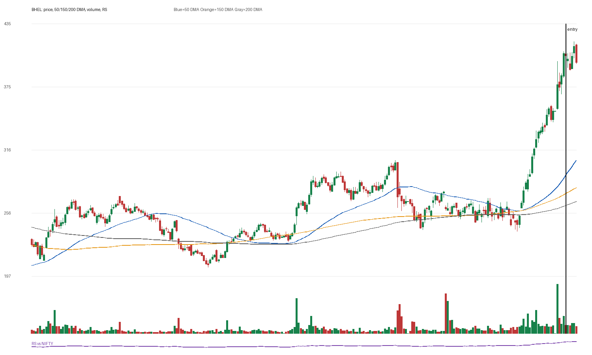

# BHEL

## Entry Progress

| Metric | Value |
|---|---:|
| Yahoo symbol | `BHEL.NS` |
| Entry close | 404.6 |
| Latest close | 398.3 |
| Current return from entry | -1.56% |
| Max gain after entry | 3.29% |
| Max drawdown after entry | -3.47% |
| Scan risk | 42.13% |
| Scan RS | 83 |
| Scan VCP | 1/3 |
| Entry trend-template score | 7/7 |
| Latest trend-template score | 7/7 |
| Pre-entry pattern quality | loose-or-extended (1/4) |
| Fundamental score | 6/6 |

## Concept Review

- [[Trend Template]]: compare entry score with latest score.
- [[Relative Strength Leadership]]: inspect the RS panel versus NIFTY.
- [[Pivot and Entry]]: judge whether the scan entry was close enough to a definable pivot.
- [[Risk First]]: scan risk above 15-20% needs stricter position sizing or a tighter pattern.
- [[Sell Rules and Failure Signals]]: watch for price losing 50 DMA/200 DMA or breaking the entry structure.

## Pre-Entry Pattern Analysis

120-session pre-entry depth split: 27.2% then 70.7%. ATR20% did not clearly contract into entry. Volume did not dry up near the final window. Entry was -0.9% from the 60-session pre-entry pivot.

| Pattern Metric | Value |
|---|---:|
| First 60-session depth | 27.19% |
| Final 60-session depth | 70.74% |
| ATR20 start | 2.88% |
| ATR20 end | 3.86% |
| Volume dry-up | False |
| Entry distance from 60-session pivot | -0.92% |

## Fundamentals

| Fundamental Metric | Value |
|---|---:|
| Market cap | 1386905731072 |
| Trailing PE | 86.965065 |
| Forward PE | 31.130175 |
| Quarterly revenue growth | 69.16610898037541% |
| Quarterly earnings growth | 858.0326651818856% |
| Annual revenue growth | 19.20536297772577% |
| Annual earnings growth | 199.73028657051884% |
| Profit margins | 0.04737 |
| Return on equity | 0.06292 |
| Debt to equity | 31.312 |

### Fundamental Checks Passed

- quarterly revenue growth positive
- quarterly earnings growth positive
- annual revenue growth positive
- annual earnings growth positive
- profit margin positive
- ROE positive

## Entry Template Conditions Passed

- close > 50 DMA
- close > 150 DMA
- close > 200 DMA
- 50 DMA > 150 DMA
- 150 DMA > 200 DMA
- near 52w high
- above 52w low

## Latest Template Conditions Passed

- close > 50 DMA
- close > 150 DMA
- close > 200 DMA
- 50 DMA > 150 DMA
- 150 DMA > 200 DMA
- near 52w high
- above 52w low

## Data

CSV: `data/BHEL_ohlcv.csv`
