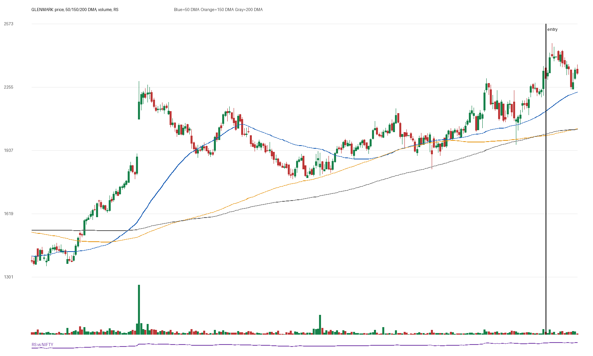

# GLENMARK

## Entry Progress

| Metric | Value |
|---|---:|
| Yahoo symbol | `GLENMARK.NS` |
| Entry close | 2299.5 |
| Latest close | 2325.9 |
| Current return from entry | 1.15% |
| Max gain after entry | 7.59% |
| Max drawdown after entry | -2.41% |
| Scan risk | 15.68% |
| Scan RS | 78 |
| Scan VCP | 1/3 |
| Entry trend-template score | 6/7 |
| Latest trend-template score | 7/7 |
| Pre-entry pattern quality | borderline (2/4) |
| Fundamental score | 4/6 |

## Concept Review

- [[Trend Template]]: compare entry score with latest score.
- [[Relative Strength Leadership]]: inspect the RS panel versus NIFTY.
- [[Pivot and Entry]]: judge whether the scan entry was close enough to a definable pivot.
- [[Risk First]]: scan risk above 15-20% needs stricter position sizing or a tighter pattern.
- [[Sell Rules and Failure Signals]]: watch for price losing 50 DMA/200 DMA or breaking the entry structure.

## Pre-Entry Pattern Analysis

120-session pre-entry depth split: 19.8% then 28.1%. ATR20% did not clearly contract into entry. Volume dried up near the final window. Entry was -2.5% from the 60-session pre-entry pivot.

| Pattern Metric | Value |
|---|---:|
| First 60-session depth | 19.8% |
| Final 60-session depth | 28.09% |
| ATR20 start | 2.21% |
| ATR20 end | 3.43% |
| Volume dry-up | True |
| Entry distance from 60-session pivot | -2.54% |

## Fundamentals

| Fundamental Metric | Value |
|---|---:|
| Market cap | 656370827264 |
| Trailing PE | 61.727703 |
| Forward PE | 29.053074 |
| Quarterly revenue growth | 17.750213210317444% |
| Quarterly earnings growth | 15.878457992539419% |
| Annual revenue growth | 12.98084063056919% |
| Annual earnings growth | -155.13950529648298% |
| Profit margins | 0.06451 |
| Return on equity | None |
| Debt to equity | 12.776 |

### Fundamental Checks Passed

- quarterly revenue growth positive
- quarterly earnings growth positive
- annual revenue growth positive
- profit margin positive

## Entry Template Conditions Passed

- close > 50 DMA
- close > 150 DMA
- close > 200 DMA
- 50 DMA > 150 DMA
- near 52w high
- above 52w low

## Latest Template Conditions Passed

- close > 50 DMA
- close > 150 DMA
- close > 200 DMA
- 50 DMA > 150 DMA
- 150 DMA > 200 DMA
- near 52w high
- above 52w low

## Data

CSV: `data/GLENMARK_ohlcv.csv`
