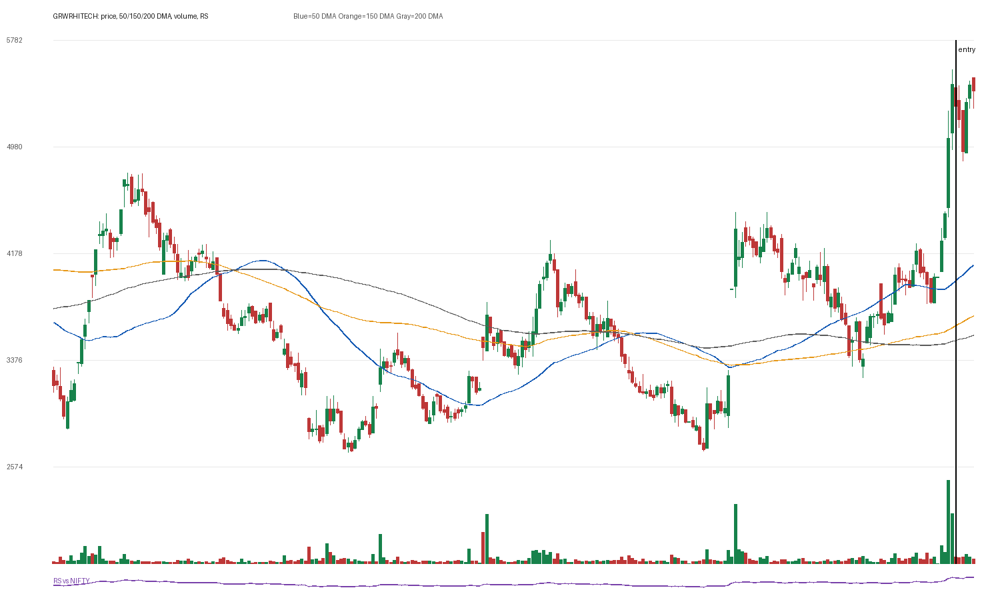

# GRWRHITECH

## Entry Progress

| Metric | Value |
|---|---:|
| Yahoo symbol | `GRWRHITECH.NS` |
| Entry close | 5290.3 |
| Latest close | 5403.4 |
| Current return from entry | 2.14% |
| Max gain after entry | 3.96% |
| Max drawdown after entry | -7.94% |
| Scan risk | 34.38% |
| Scan RS | 70 |
| Scan VCP | 0/3 |
| Entry trend-template score | 7/7 |
| Latest trend-template score | 7/7 |
| Pre-entry pattern quality | loose-or-extended (1/4) |
| Fundamental score | 6/6 |

## Concept Review

- [[Trend Template]]: compare entry score with latest score.
- [[Relative Strength Leadership]]: inspect the RS panel versus NIFTY.
- [[Pivot and Entry]]: judge whether the scan entry was close enough to a definable pivot.
- [[Risk First]]: scan risk above 15-20% needs stricter position sizing or a tighter pattern.
- [[Sell Rules and Failure Signals]]: watch for price losing 50 DMA/200 DMA or breaking the entry structure.

## Pre-Entry Pattern Analysis

120-session pre-entry depth split: 66.8% then 71.6%. ATR20% did not clearly contract into entry. Volume did not dry up near the final window. Entry was -4.9% from the 60-session pre-entry pivot.

| Pattern Metric | Value |
|---|---:|
| First 60-session depth | 66.83% |
| Final 60-session depth | 71.55% |
| ATR20 start | 4.66% |
| ATR20 end | 4.76% |
| Volume dry-up | False |
| Entry distance from 60-session pivot | -4.85% |

## Fundamentals

| Fundamental Metric | Value |
|---|---:|
| Market cap | 125533913088 |
| Trailing PE | 37.17509 |
| Forward PE | 29.656422 |
| Quarterly revenue growth | 8.896959521115445% |
| Quarterly earnings growth | 39.08740359897172% |
| Annual revenue growth | 0.509633253688313% |
| Annual earnings growth | 2.1164180906950048% |
| Profit margins | 0.1548 |
| Return on equity | 0.13454 |
| Debt to equity | 0.59 |

### Fundamental Checks Passed

- quarterly revenue growth positive
- quarterly earnings growth positive
- annual revenue growth positive
- annual earnings growth positive
- profit margin positive
- ROE positive

## Entry Template Conditions Passed

- close > 50 DMA
- close > 150 DMA
- close > 200 DMA
- 50 DMA > 150 DMA
- 150 DMA > 200 DMA
- near 52w high
- above 52w low

## Latest Template Conditions Passed

- close > 50 DMA
- close > 150 DMA
- close > 200 DMA
- 50 DMA > 150 DMA
- 150 DMA > 200 DMA
- near 52w high
- above 52w low

## Data

CSV: `data/GRWRHITECH_ohlcv.csv`
