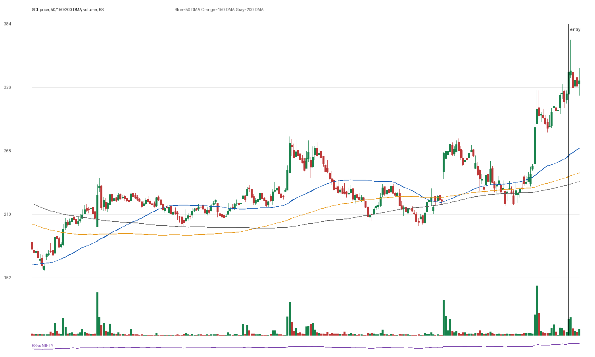

# SCI

## Entry Progress

| Metric | Value |
|---|---:|
| Yahoo symbol | `SCI.NS` |
| Entry close | 339.05 |
| Latest close | 331.4 |
| Current return from entry | -2.26% |
| Max gain after entry | 8.76% |
| Max drawdown after entry | -6.16% |
| Scan risk | 35.33% |
| Scan RS | 93 |
| Scan VCP | 1/3 |
| Entry trend-template score | 7/7 |
| Latest trend-template score | 7/7 |
| Pre-entry pattern quality | borderline (2/4) |
| Fundamental score | 5/6 |

## Concept Review

- [[Trend Template]]: compare entry score with latest score.
- [[Relative Strength Leadership]]: inspect the RS panel versus NIFTY.
- [[Pivot and Entry]]: judge whether the scan entry was close enough to a definable pivot.
- [[Risk First]]: scan risk above 15-20% needs stricter position sizing or a tighter pattern.
- [[Sell Rules and Failure Signals]]: watch for price losing 50 DMA/200 DMA or breaking the entry structure.

## Pre-Entry Pattern Analysis

120-session pre-entry depth split: 40.6% then 51.1%. ATR20% contracted into entry. Volume did not dry up near the final window. Entry was 3.1% from the 60-session pre-entry pivot.

| Pattern Metric | Value |
|---|---:|
| First 60-session depth | 40.58% |
| Final 60-session depth | 51.14% |
| ATR20 start | 5.03% |
| ATR20 end | 4.91% |
| Volume dry-up | False |
| Entry distance from 60-session pivot | 3.12% |

## Fundamentals

| Fundamental Metric | Value |
|---|---:|
| Market cap | 154365788160 |
| Trailing PE | 11.403992 |
| Forward PE | 100.42424 |
| Quarterly revenue growth | 22.50456065673456% |
| Quarterly earnings growth | 436.24205508474574% |
| Annual revenue growth | 11.043676296994054% |
| Annual earnings growth | 24.244075585077397% |
| Profit margins | 0.01102 |
| Return on equity | None |
| Debt to equity | 29.454 |

### Fundamental Checks Passed

- quarterly revenue growth positive
- quarterly earnings growth positive
- annual revenue growth positive
- annual earnings growth positive
- profit margin positive

## Entry Template Conditions Passed

- close > 50 DMA
- close > 150 DMA
- close > 200 DMA
- 50 DMA > 150 DMA
- 150 DMA > 200 DMA
- near 52w high
- above 52w low

## Latest Template Conditions Passed

- close > 50 DMA
- close > 150 DMA
- close > 200 DMA
- 50 DMA > 150 DMA
- 150 DMA > 200 DMA
- near 52w high
- above 52w low

## Data

CSV: `data/SCI_ohlcv.csv`
