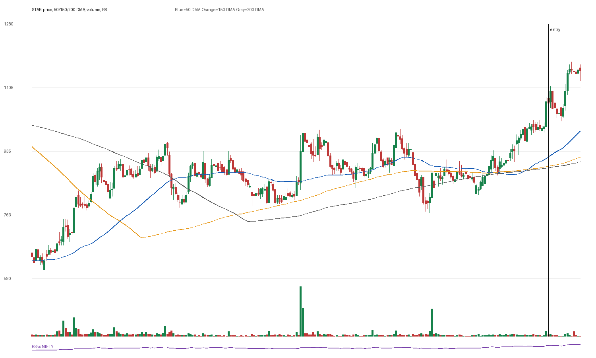

# STAR

## Entry Progress

| Metric | Value |
|---|---:|
| Yahoo symbol | `STAR.NS` |
| Entry close | 1066.25 |
| Latest close | 1153.7 |
| Current return from entry | 8.2% |
| Max gain after entry | 15.45% |
| Max drawdown after entry | -4.61% |
| Scan risk | 17.89% |
| Scan RS | 85 |
| Scan VCP | 0/3 |
| Entry trend-template score | 7/7 |
| Latest trend-template score | 7/7 |
| Pre-entry pattern quality | constructive (3/4) |
| Fundamental score | 4/6 |

## Concept Review

- [[Trend Template]]: compare entry score with latest score.
- [[Relative Strength Leadership]]: inspect the RS panel versus NIFTY.
- [[Pivot and Entry]]: judge whether the scan entry was close enough to a definable pivot.
- [[Risk First]]: scan risk above 15-20% needs stricter position sizing or a tighter pattern.
- [[Sell Rules and Failure Signals]]: watch for price losing 50 DMA/200 DMA or breaking the entry structure.

## Pre-Entry Pattern Analysis

120-session pre-entry depth split: 27.5% then 40.6%. ATR20% contracted into entry. Volume dried up near the final window. Entry was -1.4% from the 60-session pre-entry pivot.

| Pattern Metric | Value |
|---|---:|
| First 60-session depth | 27.49% |
| Final 60-session depth | 40.62% |
| ATR20 start | 3.91% |
| ATR20 end | 3.48% |
| Volume dry-up | True |
| Entry distance from 60-session pivot | -1.36% |

## Fundamentals

| Fundamental Metric | Value |
|---|---:|
| Market cap | 106339655680 |
| Trailing PE | 20.791132 |
| Forward PE | 15.902135 |
| Quarterly revenue growth | 2.3747701241029873% |
| Quarterly earnings growth | 181.31759531199978% |
| Annual revenue growth | 17.738737804029636% |
| Annual earnings growth | -437.21673155635426% |
| Profit margins | 0.10823 |
| Return on equity | None |
| Debt to equity | 65.787 |

### Fundamental Checks Passed

- quarterly revenue growth positive
- quarterly earnings growth positive
- annual revenue growth positive
- profit margin positive

## Entry Template Conditions Passed

- close > 50 DMA
- close > 150 DMA
- close > 200 DMA
- 50 DMA > 150 DMA
- 150 DMA > 200 DMA
- near 52w high
- above 52w low

## Latest Template Conditions Passed

- close > 50 DMA
- close > 150 DMA
- close > 200 DMA
- 50 DMA > 150 DMA
- 150 DMA > 200 DMA
- near 52w high
- above 52w low

## Data

CSV: `data/STAR_ohlcv.csv`
