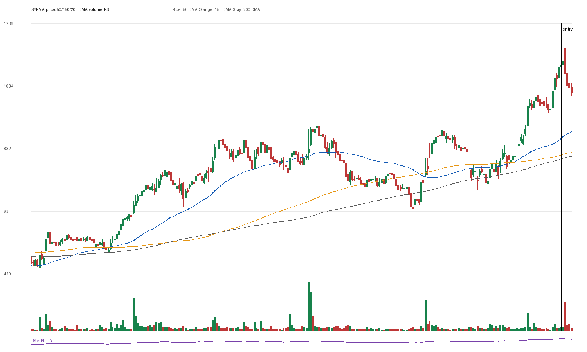

# SYRMA

## Entry Progress

| Metric | Value |
|---|---:|
| Yahoo symbol | `SYRMA.NS` |
| Entry close | 1100.15 |
| Latest close | 1013.25 |
| Current return from entry | -7.9% |
| Max gain after entry | 7.99% |
| Max drawdown after entry | -10.28% |
| Scan risk | 29.79% |
| Scan RS | 89 |
| Scan VCP | 1/3 |
| Entry trend-template score | 7/7 |
| Latest trend-template score | 7/7 |
| Pre-entry pattern quality | borderline (2/4) |
| Fundamental score | 6/6 |

## Concept Review

- [[Trend Template]]: compare entry score with latest score.
- [[Relative Strength Leadership]]: inspect the RS panel versus NIFTY.
- [[Pivot and Entry]]: judge whether the scan entry was close enough to a definable pivot.
- [[Risk First]]: scan risk above 15-20% needs stricter position sizing or a tighter pattern.
- [[Sell Rules and Failure Signals]]: watch for price losing 50 DMA/200 DMA or breaking the entry structure.

## Pre-Entry Pattern Analysis

120-session pre-entry depth split: 43.4% then 57.7%. ATR20% contracted into entry. Volume did not dry up near the final window. Entry was -0.4% from the 60-session pre-entry pivot.

| Pattern Metric | Value |
|---|---:|
| First 60-session depth | 43.4% |
| Final 60-session depth | 57.74% |
| ATR20 start | 4.1% |
| ATR20 end | 3.74% |
| Volume dry-up | False |
| Entry distance from 60-session pivot | -0.38% |

## Fundamentals

| Fundamental Metric | Value |
|---|---:|
| Market cap | 195177250816 |
| Trailing PE | 59.88475 |
| Forward PE | 35.106255 |
| Quarterly revenue growth | 45.35850375647639% |
| Quarterly earnings growth | 110.65294913309015% |
| Annual revenue growth | 18.71164262450624% |
| Annual earnings growth | 58.272771317829466% |
| Profit margins | 0.06594 |
| Return on equity | 0.14142999 |
| Debt to equity | 13.045 |

### Fundamental Checks Passed

- quarterly revenue growth positive
- quarterly earnings growth positive
- annual revenue growth positive
- annual earnings growth positive
- profit margin positive
- ROE positive

## Entry Template Conditions Passed

- close > 50 DMA
- close > 150 DMA
- close > 200 DMA
- 50 DMA > 150 DMA
- 150 DMA > 200 DMA
- near 52w high
- above 52w low

## Latest Template Conditions Passed

- close > 50 DMA
- close > 150 DMA
- close > 200 DMA
- 50 DMA > 150 DMA
- 150 DMA > 200 DMA
- near 52w high
- above 52w low

## Data

CSV: `data/SYRMA_ohlcv.csv`
